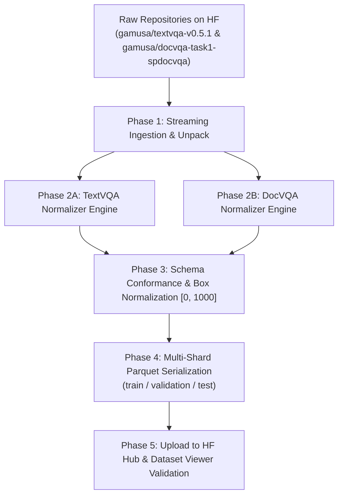

# Kế hoạch Chuẩn hóa Lược đồ Dữ liệu (Dataset Schema Normalization Plan)
## Đề tài: CrossVQA — Chuyển giao tri thức liên miền từ DocVQA sang TextVQA

---

## I. Mục tiêu & Phạm vi (Objectives & Scope)

1. **Chuẩn hóa lược đồ (Canonical Schema Harmonization):**
   * Chuyển đổi dữ liệu từ 2 kho lưu trữ gốc:
     * [`gamusa/textvqa-v0.5.1`](https://huggingface.co/datasets/gamusa/textvqa-v0.5.1) (Ảnh cảnh tự nhiên 3D - Scene Text)
     * [`gamusa/docvqa-task1-spdocvqa`](https://huggingface.co/datasets/gamusa/docvqa-task1-spdocvqa) (Ảnh tài liệu quét 2D phẳng - Document Text)
   * Khắc phục triệt để các lỗi của Hugging Face Dataset Viewer (lỗi byte `0xFF` do giải nén JPEG và lỗi gom 1 hàng `1 rows` do root JSON dictionary).

2. **Chuẩn hóa phân chia tập dữ liệu (Split Harmonization):**
   * Thống nhất tên split chuẩn theo chuẩn Hugging Face: `train`, `validation`, `test`.
   * Đảm bảo bảo toàn 100% số lượng mẫu từ bài báo gốc:
     * **TextVQA:** `train` (34,602) | `validation` (5,000) | `test` (5,734).
     * **DocVQA:** `train` (39,463) | `validation` (5,349) | `test` (5,188).

3. **Hỗ trợ song song cả 2 trường phái mô hình (OCR-free & OCR-grounded):**
   * Tích hợp ảnh đã xử lý xoay EXIF và tỷ lệ kích thước.
   * Đồng bộ hệ tọa độ bounding box OCR về thang chuẩn $[ymin, xmin, ymax, xmax] \in [0, 1000]$.

---

## II. Lược đồ Chuẩn hóa Thống nhất (Canonical Data Contract)

Mọi mẫu dữ liệu sau khi chuẩn hóa sẽ tuân theo lược đồ `CanonicalVQAItem`:

```python
from dataclasses import dataclass
from typing import List, Optional, Tuple, Dict, Any
from PIL import Image

@dataclass
class CanonicalVQAItem:
    # 1. Định danh duy nhất (Unique Identifiers)
    sample_id: str             # Tiền tố miền: "textvqa_34602" hoặc "docvqa_337"
    domain_type: str           # "scene_text" hoặc "document_text"
    split: str                 # "train", "validation", hoặc "test"
    
    # 2. Câu hỏi văn bản (Question Input)
    question_id: str           # Định danh câu hỏi gốc (ép kiểu string)
    question: str              # Chuỗi câu hỏi đã chuẩn hóa (strip whitespace)
    question_tokens: Optional[List[str]] = None
    
    # 3. Dữ liệu thị giác (Visual Input)
    image: Image.Image         # Ảnh PIL (đã sửa xoay EXIF, hệ màu RGB)
    image_id: str              # Tên file hoặc hash định danh ảnh gốc
    image_size: Tuple[int, int]# (width, height) gốc trước khi resize/padding
    
    # 4. Nhãn giám sát (Ground Truth Labels - Hỗ trợ cả tập Test không nhãn)
    answers: Optional[List[str]] = None        # Danh sách toàn bộ câu trả lời từ annotators (None ở split test)
    canonical_answer: Optional[str] = None     # Câu trả lời đại diện (Majority vote / None ở split test)
    
    # 5. Thông tin OCR (Spatial Text Grounding - Chuẩn hóa thang 0-1000)
    ocr_tokens: Optional[List[str]] = None     # Danh sách từ nhận diện được
    ocr_boxes: Optional[List[List[int]]] = None# Tọa độ [ymin, xmin, ymax, xmax] trong khoảng [0, 1000]
    
    # 6. Metadata phụ trợ chuyên biệt từng miền (Domain-Specific Metadata)
    metadata: Dict[str, Any] = None            # TextVQA: image_classes, flickr_url
                                               # DocVQA: question_types, ucsf_doc_id, page_no
```

### Bảng Ánh xạ Thuộc tính (Field Mapping Matrix)

| Thuộc tính Canonical | Kiểu dữ liệu | Nguồn TextVQA (`gamusa/textvqa-v0.5.1`) | Nguồn DocVQA (`gamusa/docvqa-task1-spdocvqa`) | Quy tắc chuẩn hóa (Transformation Rule) |
| :--- | :--- | :--- | :--- | :--- |
| `sample_id` | `string` | `f"textvqa_{question_id}"` | `f"docvqa_{questionId}"` | Đánh tiền tố để tránh xung đột ID khi gộp dữ liệu. |
| `domain_type` | `string` | `"scene_text"` | `"document_text"` | Tag miền phục vụ Domain Adaptation Loss. |
| `split` | `string` | `set_name` (`"val"` $\rightarrow$ `"validation"`) | `data_split` (`"val"` $\rightarrow$ `"validation"`) | Thống nhất `val` thành `validation`. |
| `question_id` | `string` | `str(item["question_id"])` | `str(item["questionId"])` | Ép kiểu chuỗi toàn bộ. |
| `question` | `string` | `item["question"].strip()` | `item["question"].strip()` | Làm sạch khoảng trắng thừa. |
| `image` | `Image` | `train_images/{image_id}.jpg` | `spdocvqa_images/{image}` | Áp dụng `ImageOps.exif_transpose` cho TextVQA. |
| `image_size` | `(int, int)` | `(image_width, image_height)` | Lấy trực tiếp từ `image.size` | Lưu kích thước thực $(W, H)$. |
| `answers` | `list[str]` | `item.get("answers")` | `item.get("answers")` | Trả về `None` nếu là tập `test`. |
| `canonical_answer` | `str` | `mode(answers)` | `mode(answers)` | Bầu chọn đa số (Majority Vote) để tính CE Loss. |
| `ocr_tokens` | `list[str]` | Rosetta OCR v0.2 `word_list` | Microsoft OCR tokens | Lọc bỏ token rác, hạ chữ thường nếu cần. |
| `ocr_boxes` | `list[list]` | Rosetta OCR bounding boxes | Microsoft OCR bounding boxes | Chuẩn hóa hệ toạ độ về $[ymin, xmin, ymax, xmax] \in [0, 1000]$. |
| `metadata` | `dict` | `{"image_classes": ..., "flickr_url": ...}` | `{"question_types": ..., "ucsf_id": ..., "page": ...}` | Giữ nguyên các trường đặc thù của từng miền. |

---

## III. Quy trình Thực thi Kỹ thuật (5 Giai đoạn)



### Giai đoạn 1: Nạp và Giải nén Dữ liệu Thô (Ingestion & Extraction)
1. Sử dụng môi trường Google Colab Pro hoặc máy local có tối thiểu 40 GB dung lượng trống.
2. Tải các file nén qua `hf_hub_download` và giải nén có kiểm soát:
   * **TextVQA:** `images/train_val_images.zip`, `images/test_images.zip`, `annotations/*.json`, `ocr/*.json`.
   * **DocVQA:** `images/spdocvqa_images.tar.gz`, `annotations/*.json`, `ocr/spdocvqa_ocr.tar.gz`.

### Giai đoạn 2: Xây dựng Module Chuẩn hóa (Normalizer Engine)
1. **Module Xử lý Thị giác (Vision Pipeline):**
   * Đọc ảnh qua `PIL.Image`.
   * Với TextVQA: Áp dụng `ImageOps.exif_transpose` để đưa ảnh về hướng thẳng đứng đúng thực tế.
   * Với DocVQA: Kiểm tra dung lượng và kích thước lớn (nhiều ảnh đạt $2500 \times 3500$), ghi nhận $(W, H)$ gốc.
2. **Module Chuẩn hóa OCR & Bounding Box:**
   * TextVQA: Tọa độ gốc Rosetta ở dạng $[x, y, w, h]$. Chuyển đổi sang:
     $$ymin = \frac{y}{H} \times 1000, \quad xmin = \frac{x}{W} \times 1000, \quad ymax = \frac{y + h}{H} \times 1000, \quad xmax = \frac{x + w}{W} \times 1000$$
   * DocVQA: Tọa độ Microsoft OCR thường là đa giác 8 điểm hoặc $[x_1, y_1, x_2, y_2]$. Chuẩn hóa tương tự về cùng định dạng $[ymin, xmin, ymax, xmax] \in [0, 1000]$.
3. **Module Xử lý Nhãn (Labels & Majority Voting):**
   * Tập `train` và `validation`: Tính `canonical_answer` bằng tần suất xuất hiện cao nhất trong `answers`.
   * Tập `test`: Gán `answers = None` và `canonical_answer = None` an toàn.

### Giai đoạn 3: Phân chia Tập dữ liệu (Split Harmonization)
Đảm bảo khớp số liệu chính xác:
* **TextVQA Splits:**
  * `train`: 34,602 samples.
  * `validation`: 5,000 samples.
  * `test`: 5,734 samples.
* **DocVQA Splits:**
  * `train`: 39,463 samples.
  * `validation`: 5,349 samples.
  * `test`: 5,188 samples.

### Giai đoạn 4: Đóng gói sang Định dạng Parquet (Serialization)
* Thay vì để file JSON thô lồng nhau, chuyển toàn bộ sang **Apache Parquet**:
  * Lưu trữ dạng cột nén (Snappy/ZSTD), giảm dung lượng lưu trữ từ $3\times$ đến $5\times$.
  * Tích hợp kiểu dữ liệu `datasets.Image()` trực tiếp vào cột `image` để hỗ trợ streaming mà không cần tải file zip rời.
  * Phân shard file Parquet (ví dụ: mỗi shard ~500 MB - 1 GB) để tối ưu hóa việc nạp dữ liệu song song trên PyTorch DataLoader.

### Giai đoạn 5: Xuất bản và Kiểm thử Hub (Deployment & Verification)
1. Đẩy các file Parquet chuẩn lên repository mới (hoặc tạo nhánh `normalized` / config riêng):
   * Ví dụ: `gamusa/crossvqa-canonical` hoặc cập nhật trực tiếp `gamusa/textvqa-v0.5.1` và `gamusa/docvqa-task1-spdocvqa`.
2. Viết file `README.md` với đầy đủ thẻ `dataset_info`, định nghĩa rõ các splits và schema features.
3. Kiểm thử trên Hugging Face Dataset Viewer:
   * Đảm bảo hiển thị đúng số hàng (`train: 34,602 rows`, `train: 39,463 rows`).
   * Không còn lỗi Byte `0xFF`.
   * Cho phép xem trước ảnh, câu hỏi và nhãn trực tiếp trên trình duyệt.

---

## IV. Kế hoạch Hành động Cụ thể (Step-by-Step Milestones)

| Milestone | Tác vụ trọng tâm | Deliverables | Thời gian dự kiến |
| :--- | :--- | :--- | :--- |
| **M1** | Viết script trích xuất và chuẩn hóa TextVQA | `normalize_textvqa.py` (JSON/Parquet) | 1 buổi |
| **M2** | Viết script trích xuất và chuẩn hóa DocVQA | `normalize_docvqa.py` (JSON/Parquet) | 1 buổi |
| **M3** | Đóng gói Parquet và nhúng ảnh / OCR | Sharded `.parquet` cho cả 3 splits | 1 buổi |
| **M4** | Đẩy dữ liệu lên Hugging Face Hub | Repository Parquet hoàn chỉnh | Nửa buổi |
| **M5** | Viết PyTorch DataLoader mẫu & Unit Tests | `CrossVQADataLoader` test pass 100% | Nửa buổi |
