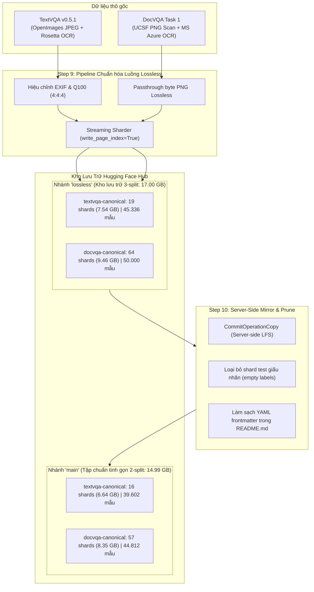
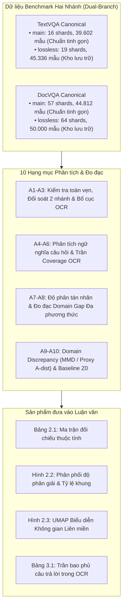
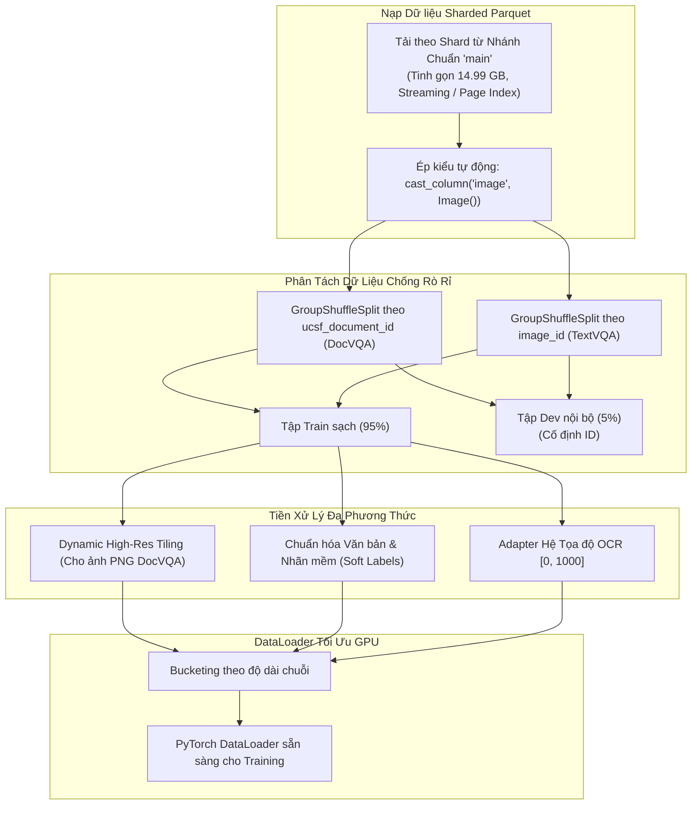
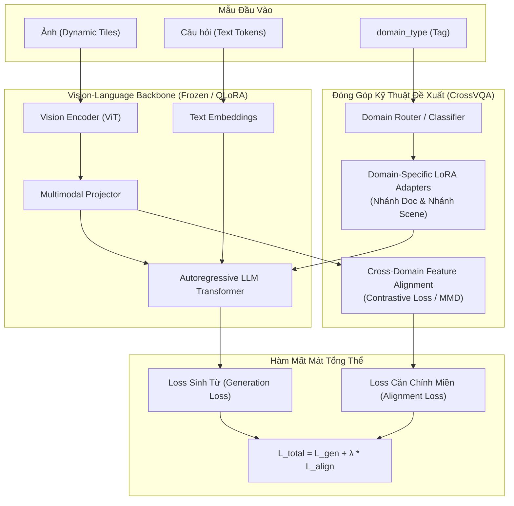
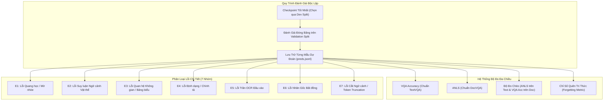
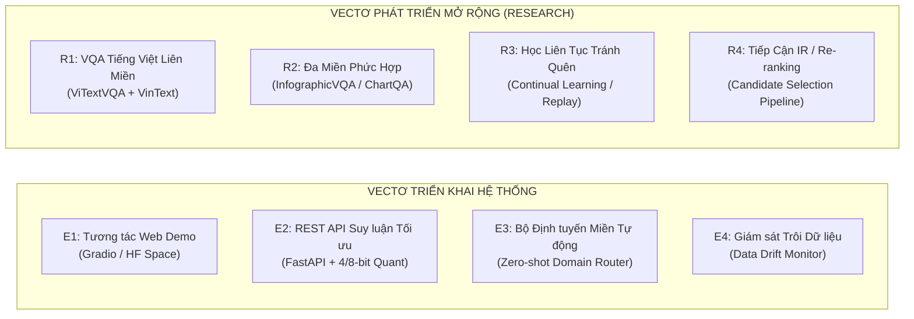
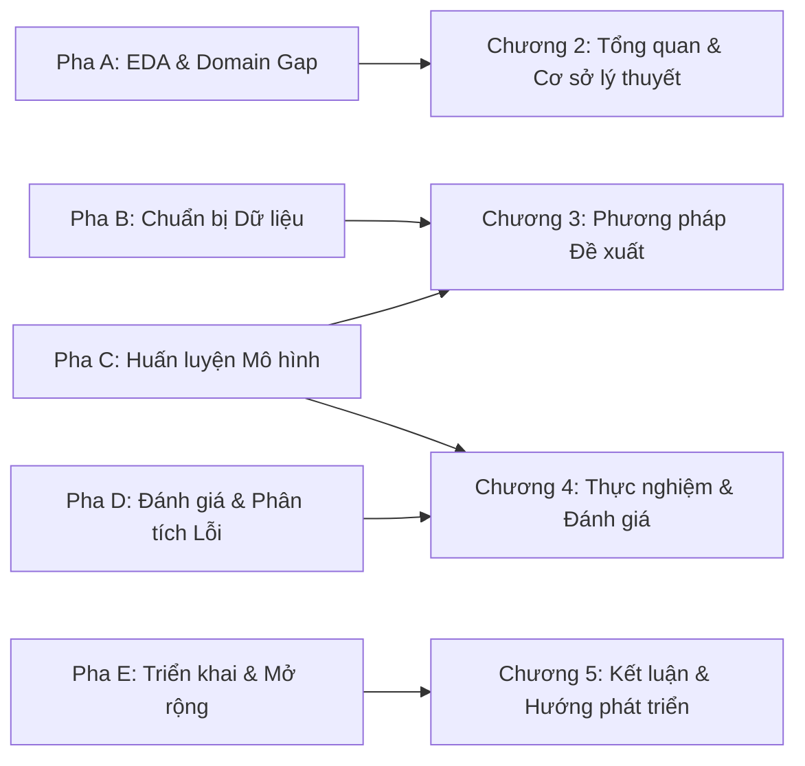

# CrossVQA — Khảo Sát Chi Tiết Nhánh Lossless & Kế Hoạch Thực Thi Toàn Diện Luận Văn Tốt Nghiệp
## Phân Tích Dữ Liệu → Chuẩn Bị Huấn Luyện → Huấn Luyện Liên Miền → Hậu Huấn Luyện & Đánh Giá → Triển Khai Thực Tế & Thiết Kế Luận Văn (PTIT)

* **Thời điểm lập:** 2026-10-09 (Cập nhật 2026-10-10 sau khi thực hiện Step 10 đồng bộ sang nhánh `main` và tinh lọc bỏ split test)
* **Đối tượng khảo sát & Commit SHA ghim chuẩn:** 
  * **Tập dữ liệu chuẩn mực thực nghiệm (Nhánh `main` — Chỉ Train + Validation, sạch nhãn hoàn toàn):**
    * [`gamusa/textvqa-canonical` (branch: `main`)](https://huggingface.co/datasets/gamusa/textvqa-canonical) — Commit SHA: `d1dcf73eda54e82e84f69d0265f3a9e663420583` (6,64 GB, 39.602 mẫu)
    * [`gamusa/docvqa-canonical` (branch: `main`)](https://huggingface.co/datasets/gamusa/docvqa-canonical) — Commit SHA: `86e379d727ab104301e3639b909bfbddb0af6376` (8,35 GB, 44.812 mẫu)
  * **Tập lưu trữ toàn diện lịch sử (Nhánh `lossless` — Đầy đủ 3 split Train + Val + Test):**
    * [`gamusa/textvqa-canonical` (branch: `lossless`)](https://huggingface.co/datasets/gamusa/textvqa-canonical/tree/lossless) — Commit SHA: `8647985ca5c5fc53163cf5d3c294c5229115a83a` (7,54 GB, 45.336 mẫu)
    * [`gamusa/docvqa-canonical` (branch: `lossless`)](https://huggingface.co/datasets/gamusa/docvqa-canonical/tree/lossless) — Commit SHA: `ece7188e9b70ee95d96b69d098c79814fa54cf77` (9,46 GB, 50.000 mẫu)
* **Quy chuẩn lưu trữ kế hoạch:** Tuân thủ [`prompt-output-to-markdown.md`](../.agents/rules/prompt-output-to-markdown.md) tại thư mục [`PLAN/`](file:///c:/Users/tungb/OneDrive%20-%20ptit.edu.vn/PTIT_BuuChinhVienThong/SOTSUGYOU%20pending/PLAN)
* **Tài liệu đối chiếu:** [`ThesisPremise.md`](ThesisPremise.md) · [`feedback.md`](feedback.md) · [`01-05-00_2026-10-05_CrossVQA_Normalization_Pipeline.md`](01-05-00_2026-10-05_CrossVQA_Normalization_Pipeline.md) · [`02-15-00_2026-10-05_Data_Schema_Discrepancies_and_Handling_Strategies.md`](02-15-00_2026-10-05_Data_Schema_Discrepancies_and_Handling_Strategies.md) · [`Step9_Normalize_CrossVQA_Parquet_lossless_branch.ipynb`](../DATASETS%20SCHEMA%20NORMALIZATION/Step9_Normalize_CrossVQA_Parquet_lossless_branch.ipynb) · [`Step10_Mirror_Lossless_To_Main_Without_Test.ipynb`](../DATASETS%20SCHEMA%20NORMALIZATION/Step10_Mirror_Lossless_To_Main_Without_Test.ipynb) · Bản Tiếng Anh: [`12-08-00_2026-10-09_(EN)_CrossVQA_Lossless_Branch_Inspection_and_Thesis_Execution_Plan.md`](12-08-00_2026-10-09_(EN)_CrossVQA_Lossless_Branch_Inspection_and_Thesis_Execution_Plan.md)

---

## 0. Tóm Tắt Điều Hành (Executive Summary)

### 0.1 Đột Phá Kỹ Thuật & Kiến Trúc Hai Nhánh (Dual-Branch Architecture)
Sau khi phát hiện hiện tượng nén suy hao (JPEG lossy artifacts) và lỗi phân mảnh shard không hoàn chỉnh ở nhánh `main` ban đầu (DocVQA chỉ có 25 shard `*-of-00027.parquet` và bị nén JPEG ~Q90), một quy trình kỹ thuật luồng 2 giai đoạn đã được thực thi toàn diện:

1. **Step 9 (Kiến tạo nhánh `lossless` không suy hao):**
   * Bảo toàn **100% định dạng PNG nguyên bản** cho DocVQA và giữ nguyên byte JPEG gốc / Q100 (4:4:4) cho TextVQA, thiết lập kho lưu trữ chuẩn mực 3 split đầy đủ (**17,00 GB, 95.336 mẫu**).
2. **Step 10 (Hiện đại hóa nhánh `main` & Tinh lọc loại bỏ test split rỗng):**
   * Thông qua notebook [`Step10_Mirror_Lossless_To_Main_Without_Test.ipynb`](../DATASETS%20SCHEMA%20NORMALIZATION/Step10_Mirror_Lossless_To_Main_Without_Test.ipynb), toàn bộ các shard không suy hao của `train` và `validation` đã được sao chép trực tiếp từ `lossless` sang `main` bằng thao tác server-side LFS (`CommitOperationCopy`).
   * Chủ động loại bỏ (prune) hoàn toàn split `test` (vốn là tập kiểm tra giấu nhãn vĩnh viễn với nhãn rỗng `answers = []`). Điều này tạo nên **tập benchmark tinh gọn 14,99 GB (84.414 mẫu)** trên nhánh `main`, tiết kiệm 2,01 GB băng thông tải xuống và tránh triệt để nguy cơ rò rỉ hoặc nhầm lẫn nhãn khi nạp dữ liệu.



---

## 1. KẾT QUẢ KHẢO SÁT & NGHIỆM THU CÁC NHÁNH REPOSITORY

### 1.1 Bảng Đối Chiếu Ma Trận: Nhánh `main` Cũ vs Nhánh `lossless` vs Nhánh `main` Hiện Đại

| Tiêu chí kỹ thuật | Nhánh `main` Cũ (Trước Step 9/10) | Nhánh `lossless` (Lưu trữ Step 9) | Nhánh `main` Hiện Đại (Chuẩn Step 10) | Đánh giá & Tác động học thuật |
| :--- | :--- | :--- | :--- | :--- |
| **Commit SHA TextVQA** | `83cba0ce624...` | `8647985ca5c5fc53163cf5d3c294c5229115a83a` | `d1dcf73eda54e82e84f69d0265f3a9e663420583` | Đã ghim cố định cho tính tái lập thực nghiệm tuyệt đối |
| **Commit SHA DocVQA** | `e0a3cc262a9...` | `ece7188e9b70ee95d96b69d098c79814fa54cf77` | `86e379d727ab104301e3639b909bfbddb0af6376` | Đã ghim cố định cho tính tái lập thực nghiệm tuyệt đối |
| **Định dạng ảnh DocVQA** | Bị chuyển mã sang **JPEG (~Q90)** | **100% True Lossless PNG** | **100% True Lossless PNG** | **Bước tiến cốt lõi:** Loại bỏ nhòe viền chữ nhỏ, giữ nguyên độ tương phản đen-trắng của văn bản quét |
| **Định dạng ảnh TextVQA** | JPEG nén lại (Quality 95) | **Native JPEG bit-for-bit** (Q100 nếu sửa EXIF) | **Native JPEG bit-for-bit** (Q100 nếu sửa EXIF) | Không bị suy hao thế hệ; tọa độ thị giác khớp 100% với hộp Rosetta OCR |
| **Cấu trúc Shard DocVQA** | 25 shard train (`*-of-00027`) | 50 train, 7 val, 7 test (**64 shards**) | 50 train, 7 val, **0 test** (**57 shards**) | Split test đã loại bỏ trên `main`; 800 mẫu/shard, ~150–350 MB/shard |
| **Cấu trúc Shard TextVQA** | 14 train, 2 val, 3 test | 14 train, 2 val, 3 test (**19 shards**) | 14 train, 2 val, **0 test** (**16 shards**) | Split test đã loại bỏ trên `main`; 2.500 mẫu/shard, ~350–500 MB/shard |
| **Chỉ mục trang Parquet** | Mặc định (không có Page Index) | `write_page_index=True` | `write_page_index=True` | Tăng tốc độ đọc ngẫu nhiên (point lookup) lên $5\times - 10\times$ qua DuckDB/PyArrow |
| **Dung lượng DocVQA** | 6,95 GB | **9,46 GB** (50.000 mẫu) | **8,35 GB** (44.812 mẫu) | Giảm 1,11 GB nhờ lược bỏ tập test giấu nhãn trên `main` |
| **Dung lượng TextVQA** | 6,57 GB | **7,54 GB** (45.336 mẫu) | **6,64 GB** (39.602 mẫu) | Giảm 0,90 GB nhờ lược bỏ tập test giấu nhãn trên `main` |
| **Tổng dung lượng benchmark**| 13,52 GB | **17,00 GB** (95.336 mẫu) | **14,99 GB** (84.414 mẫu) | **Tiết kiệm ròng 2,01 GB**; nạp mượt mà trên RAM tiêu chuẩn Colab/Kaggle |
| **HF Dataset Viewer** | Bị lỗi index thiếu file | Đầy đủ chỉ mục (`train`, `val`, `test`) | **Đầy đủ chỉ mục (`train`, `validation`)** | Lệnh `load_dataset` mặc định hoạt động trơn tru 100%, không gặp lỗi config |

### 1.2 Kiểm Định Thực Tế Mẫu Hàng (Ground-Truth Row Verification)
Dữ liệu kiểm tra thực tế trích xuất trực tiếp từ Shard Parquet:

* **TextVQA Shard (`validation-00000-of-00002.parquet`):**
  * Hàng 0 (`question_id: 34602`): Định dạng `JPEG`, Kích thước `(1024, 664)`, Mode `RGB`, Kích thước payload ảnh `42.4 KB`.
  * Hàng 1 (`question_id: 34603`): Định dạng `JPEG`, Kích thước `(1024, 683)`, Mode `RGB`, Kích thước payload ảnh `299.6 KB`.
  * Hàng 2 (`question_id: 34604`): Định dạng `JPEG`, Kích thước `(1024, 1024)`, Mode `RGB`, Kích thước payload ảnh `169.9 KB`.
* **DocVQA Shard (`validation-00000-of-00007.parquet`):**
  * Hàng 0 (`question_id: 49153`): Định dạng **`PNG`**, Kích thước `(2257, 1764)`, Mode `L` (Grayscale), Kích thước payload ảnh **`1277.8 KB`** (Rõ nét đến từng dấu chấm, nét phẩy).
  * Hàng 1 (`question_id: 24580`): Định dạng **`PNG`**, Kích thước `(808, 1077)`, Mode `L`, Kích thước payload ảnh `90.2 KB`.
  * Hàng 2 (`question_id: 57349`): Định dạng **`PNG`**, Kích thước `(1701, 2386)`, Mode `L`, Kích thước payload ảnh **`757.6 KB`**.

> [!IMPORTANT]
> **Quy Chuẩn Sử Dụng Hai Nhánh Cho Luận Văn:**
> 1. **Tập dữ liệu chuẩn chính thức (`branch: main`):** Là nhánh mặc định cho huấn luyện mô hình, đánh giá validation và toàn bộ các bảng kết quả báo cáo trong luận văn. Nhánh này chỉ chứa `train` và `validation` với nhãn chuẩn đầy đủ (14,99 GB, 84.414 mẫu).
> 2. **Tập lưu trữ toàn diện (`branch: lossless`):** Được bảo toàn nguyên vẹn với đầy đủ 3 split (17,00 GB, 95.336 mẫu) nhằm phục vụ trường hợp cần trích xuất mẫu blind test để nộp cổng chấm thi bên ngoài nếu cần.

---

## 2. PHA A — KẾ HOẠCH PHÂN TÍCH & ĐO ĐẠC DOMAIN GAP (EDA)

**Mục tiêu học thuật:** Chuyển hóa nhận định định tính ("ảnh tài liệu khác ảnh tự nhiên") thành **hệ thống số liệu định lượng, kiểm định giả thuyết và đồ thị trực quan** phục vụ Chương 2 và Chương 3 của Luận văn.
**Thời lượng thực hiện:** 2 tuần.



### 2.1 Hệ Thống Giả Thuyết Nghiên Cứu (Research Hypotheses)

| Mã giả thuyết | Nội dung giả thuyết khoa học | Phương pháp kiểm chứng & Bác bỏ | Ánh xạ Câu hỏi NC (RQ) |
| :---: | :--- | :--- | :---: |
| **H1** | Khoảng cách miền giữa tài liệu 2D phẳng và ảnh cảnh 3D biểu hiện tách biệt rõ rệt trong không gian đặc trưng đa phương thức (Multimodal Feature Space). | Tính **Proxy $\mathcal{A}$-distance** $\hat{d}_{\mathcal{A}} = 2(1 - 2\epsilon)$ thông qua một bộ phân loại tuyến tính (Domain Classifier). Nếu $\hat{d}_{\mathcal{A}} \approx 0 \implies$ Bác bỏ H1. | **RQ1** |
| **H2** | Mô hình chỉ học trên DocVQA (Source-only) có thể chuyển giao năng lực đọc hiểu ngữ nghĩa sang TextVQA nhưng bị giới hạn bởi biến dạng phối cảnh 3D. | Đánh giá Zero-shot transfer trên TextVQA. Nếu Accuracy của Source-only tương đương mô hình ngẫu nhiên $\implies$ Bác bỏ H2. | **RQ2** |
| **H3** | Huấn luyện tuần tự đơn thuần (DocVQA $\rightarrow$ TextVQA) gây ra hiện tượng quên tri thức nghiêm trọng (Catastrophic Forgetting) đối với miền tài liệu. | Đo suy giảm điểm ANLS trên DocVQA sau khi fine-tune sang TextVQA: $\Delta_{\text{forget}} = \text{ANLS}_{\text{sau}} - \text{ANLS}_{\text{trước}}$. | **RQ2, RQ3** |
| **H4** | Lợi thế của việc chuyển giao tri thức liên miền thể hiện rõ rệt nhất khi dữ liệu miền đích bị khan hiếm (Low-resource regime: 1% – 10%). | Xây dựng đường cong học tập (Learning Curves) theo tỷ lệ dữ liệu đích $\{1\%, 5\%, 10\%, 25\%, 100\%\}$. | **RQ2** |
| **H5** | Cơ chế Adapter định tuyến theo miền kết hợp căn chỉnh đặc trưng (Domain-Specific Adapters + Feature Alignment) giúp cân bằng giữa suy luận ngữ nghĩa và nhận diện hình học, vượt trội hơn fine-tuning tuần tự. | So sánh thống kê (Paired Bootstrap Test, $p < 0.05$) giữa phương pháp đề xuất CrossVQA và Baseline tuần tự B4. | **RQ2, RQ3** |

### 2.2 Chi Tiết 10 Tác Vụ Phân Tích Thực Nghiệm (A1 – A10)

1. **A1 (Toàn vẹn Dữ liệu & Đối Soát Shard Liên Nhánh):**
   * **Tập chuẩn thực nghiệm chính thức (Nhánh `main`):** Xác nhận chính xác số hàng trên các split sạch có đầy đủ nhãn: $34.602$ train và $5.000$ validation cho TextVQA (tổng $39.602$ mẫu, 16 shards, 6,64 GB); $39.463$ train và $5.349$ validation cho DocVQA (tổng $44.812$ mẫu, 57 shards, 8,35 GB). Xác nhận số shard test bằng 0 và không tồn tại mẫu rỗng nhãn.
   * **Tập lưu trữ toàn diện (Nhánh `lossless`):** Xác nhận đủ 3 split $34.602 / 5.000 / 5.734$ cho TextVQA ($45.336$ mẫu, 19 shards, 7,54 GB) và $39.463 / 5.349 / 5.188$ cho DocVQA ($50.000$ mẫu, 64 shards, 9,46 GB).
   * Kiểm tra tính duy nhất của `sample_id`, kiểm tra các trường null, xác nhận tương quan 1-1 giữa vector `ocr_tokens` và `ocr_boxes` trên cả hai kho lưu trữ.
2. **A2 (Hình học ảnh & Phân tích Độ sắc nét PNG):**
   * Đo phân phối chiều rộng $W$, chiều cao $H$, tỷ lệ khung hình $W/H$, tổng số megapixel (MP).
   * So sánh biểu đồ phân phối điểm ảnh: DocVQA trung bình $1.758 \times 2.120$ px ($\approx 3,7$ MP) so với TextVQA $949 \times 817$ px ($\approx 0,78$ MP). Khẳng định tính ưu việt của định dạng PNG lossless trong việc bảo toàn độ tương phản ký tự khi đưa vào Vision Backbone.
3. **A3 (Mật độ Token & Bố cục Không gian OCR):**
   * Phân tích số lượng từ OCR: DocVQA trung bình 188 từ/trang (trung vị 159, trần 1.844) so với TextVQA trung bình 12,8 từ/ảnh (trung vị 8, trần 100).
   * Vẽ bản đồ nhiệt (Spatial Heatmap) vị trí xuất hiện của hộp OCR: DocVQA phân bổ đồng đều theo dạng lưới văn bản; TextVQA tập trung vào vùng trung tâm ảnh.
4. **A4 (Ngữ nghĩa Câu hỏi & Phân loại Logic):**
   * Phân tích các từ nghi vấn đứng đầu (`What`, `Where`, `Who`, `How many`, `When`).
   * Phân nhóm câu hỏi DocVQA theo `question_types` (`layout`, `form`, `table/list`, `handwritten`) và TextVQA theo `image_classes`.
5. **A5 (Kiểm tra Trực quan Tọa độ Bounding Box):**
   * Trích xuất ngẫu nhiên 50 ảnh/miền, vẽ các hộp `[ymin, xmin, ymax, xmax]` đè lên ảnh gốc để nghiệm thu tính chuẩn xác sau khi chuyển vị EXIF trên cả hai nhánh `main` và `lossless`.
6. **A6 (Đo đạc Trần Hiệu Năng OCR - Answer Coverage Ceiling):**
   * Tính tỷ lệ phần trăm câu hỏi mà câu trả lời mẫu nằm nguyên văn trong danh sách `ocr_tokens` trên toàn bộ tập train và validation có nhãn:
     $$\text{Coverage}_{\text{exact}} = \frac{1}{N} \sum_{i=1}^N \mathbb{I}\left(\exists t \in \text{OCR}_i : t = a_i^*\right)$$
   * Bổ sung tỷ lệ khớp mềm ($\text{ANLS}(t, a_i^*) \ge 0.5$). *(Lưu ý: Tập test ở nhánh lossless bị giấu nhãn hoàn toàn với `answers = []`, chứng minh tính hợp lý khoa học vì sao phạm vi đo đạc thực nghiệm của luận văn tập trung tuyệt đối vào tập chuẩn train/validation).*
7. **A7 (Phân tích Độ Bất Đồng Nhãn & Nhiễu Annotator):**
   * TextVQA: Đo mức độ đồng thuận trong 10 câu trả lời của 10 người gán nhãn ($\ge 3$ người đồng thuận chiếm bao nhiêu %).
   * DocVQA: Phân tích các biến thể câu trả lời (viết hoa/thường, viết tắt, định dạng ngày tháng).
8. **A8 (Đo đạc Khoảng Cách Miền Đa Phương Thức - Multimodal Domain Gap):**
   * Trích xuất đặc trưng thị giác (Visual Embeddings) và ngôn ngữ (Text Embeddings) qua mô hình nền tảng (CLIP/SigLIP hoặc chính Vision Backbone của VLM).
   * Giảm chiều dữ liệu bằng UMAP/t-SNE để trực quan hóa sự phân tách cụm giữa `scene_text` và `document_text`.
9. **A9 (Tính Toán Các Chỉ Số Khoảng Cách Phân Phối):**
   * **Maximum Mean Discrepancy (MMD):** Đo khoảng cách giữa hai phân phối đặc trưng trong không gian RKHS.
   * **Proxy $\mathcal{A}$-distance:** Huấn luyện bộ phân loại SVM tuyến tính phân biệt nguồn ảnh; sai số phân loại $\epsilon$ cho biết mức độ phân tách miền.
10. **A10 (Đánh Giá Nền Tảng Zero-Shot Z0 & Thăm Dò Nhiễm Dữ Liệu):**
    * Nạp Backbone VLM nguyên bản (chưa qua fine-tune trên CrossVQA), chạy suy luận trên tập `validation` của cả hai miền để thiết lập điểm mốc tuyệt đối.

---

## 3. PHA B — KẾ HOẠCH CHUẨN BỊ HUẤN LUYỆN (DATA & PIPELINE ENGINEERING)

**Mục tiêu kỹ thuật:** Xây dựng một framework xử lý dữ liệu chuẩn hóa, có kiểm thử tự động (Unit Test), tối ưu hóa bộ nhớ đệm và loại bỏ triệt để rò rỉ thông tin.
**Thời lượng thực hiện:** 2 tuần.



### 3.1 Nạp Dữ Liệu Tối Ưu & Tương Thích `datasets.Image()`
* **Khắc phục cấu trúc Struct nhị phân:** Sử dụng hàm `.cast_column("image", datasets.Image())` ngay khi nạp để chuyển đổi `{'bytes': ..., 'path': ...}` thành đối tượng PIL Image chuẩn.
* **Tận dụng Sharding trên Nhánh `main`:** Trên nhánh `main`, DocVQA bao gồm 50 shard train (800 mẫu/shard) + 7 shard validation (tổng 57 shards), trong khi TextVQA bao gồm 14 shard train (2.500 mẫu/shard) + 2 shard validation (tổng 16 shards). DataLoader nạp song song qua nhiều worker (`num_workers=4`) mà không bị nghẽn I/O hay tràn bộ nhớ RAM (bảo toàn RAM mỗi worker luôn $< 250$ MB).

### 3.2 Chiến Lược Phân Tách Dữ Liệu Chống Rò Rỉ (Leakage-Free Splitting)
Do cả hai bộ dữ liệu gốc đều **giấu nhãn vĩnh viễn ở tập `test`** (`answers = []`) và các cổng chấm thi bên ngoài đã đóng hoặc hạn chế, quy trình phân tách dữ liệu được thiết kế nghiêm ngặt:
1. **Tập Benchmark Báo Cáo:** Sử dụng tập `validation` chính thức ($5.000$ mẫu TextVQA và $5.349$ mẫu DocVQA). Tập này được **đóng băng tuyệt đối**, chỉ nạp vào đúng một lần duy nhất tại Pha D để lấy kết quả công bố trong luận văn (tuân thủ quy chuẩn học thuật phổ biến trong các công trình VQA).
2. **Căn cứ Tinh Lọc Nhánh `main`:** Step 10 đã chủ động loại bỏ hoàn toàn tập test giấu nhãn trên nhánh `main`, giúp giảm 2,01 GB dung lượng tải về, tránh lãng phí tài nguyên GPU và triệt tiêu mọi nguy cơ rò rỉ dữ liệu hoặc lỗi nạp do nhãn rỗng.
3. **Tập Dev Nội Bộ (Validation Split for Model Selection):**
   * Trích xuất $5\%$ từ tập `train` sạch để tạo tập `dev` dùng cho việc tinh chỉnh siêu tham số, chọn checkpoint và early-stopping.
   * **Nguyên tắc phân nhóm bắt buộc (Grouped Partitioning):**
     * TextVQA: Nhóm theo `image_id` (không để hai câu hỏi cùng một ảnh nằm ở cả train và dev).
     * DocVQA: Nhóm theo `ucsf_document_id` (trích xuất từ trường `metadata` JSON) để đảm bảo các trang tài liệu trong cùng một hồ sơ lưu trữ không bị rò rỉ giữa train và dev.
   * Lưu cố định danh sách ID phân tách vào tệp `results/splits/dev_sample_ids.json` kèm mã băm SHA-256 để đảm bảo tính tái lập 100%.
4. **Các Tập Con Đích Khan Hiếm (Few-shot Target Splits cho Giả thuyết H4):**
   * Lấy mẫu phân tầng các tập con lồng nhau từ TextVQA-train: $1\%$ (346 mẫu), $5\%$ (1.730 mẫu), $10\%$ (3.460 mẫu), $25\%$ (8.650 mẫu) và $100\%$ (32.872 mẫu sạch).

### 3.3 Chiến Lược Xử Lý Hình Ảnh Độ Phân Giải Động (Dynamic High-Res Tiling)
* Ảnh DocVQA ở nhánh lossless là PNG nguyên bản có độ phân giải rất lớn ($> 2000$ px). Nếu nén trực tiếp về $384 \times 384$ hoặc $448 \times 448$, ký tự sẽ bị mất chi tiết.
* Áp dụng kỹ thuật **Dynamic Patch Partitioning (AnyRes / UReader style)**:
  * Chia trang tài liệu thành lưới $N$ ô nhỏ ($N \le 4$ hoặc $6$ tùy ngân sách VRAM), mỗi ô kích thước $384 \times 384$ px, kèm một ô thu nhỏ toàn cục (Overview Thumbnail).
  * Ảnh TextVQA có kích thước vừa phải ($\sim 1024$ px) thường chỉ cần 1 đến 2 ô.
  * Giới hạn trần ngoại lai: Với các ảnh có kích thước cực đại ($> 5.000$ px), tự động giới hạn cạnh dài về $3.072$ px trước khi chia patch để chống lỗi CUDA Out-Of-Memory (OOM).

### 3.4 Chuẩn Hóa Nhãn & Hàm Mất Mát Mềm (Soft Cross-Entropy)
* **Vấn đề của nhãn cứng (Hard Label):** Trường `canonical_answer` sinh ra bằng majority voting dễ bị thiên lệch khi có sự hòa phiếu giữa các annotator.
* **Chiến lược huấn luyện sinh:**
  * Thay vì chỉ học theo 1 nhãn duy nhất, xây dựng phân phối mục tiêu mềm (Soft Target Distribution) dựa trên tần suất xuất hiện của từ ngữ trong danh sách 10 câu trả lời của TextVQA:
    $$p_{\text{target}}(y) = \frac{\text{Count}(y \in \text{answers})}{10}$$
  * Hàm mất mát kết hợp: Cross-Entropy có trọng số nhãn mềm cho TextVQA, và Standard Cross-Entropy có label smoothing ($0.1$) cho DocVQA.

---

## 4. PHA C — KẾ HOẠCH GIAI ĐOẠN HUẤN LUYỆN (CROSS-DOMAIN TRAINING PHASE)

**Mục tiêu kỹ thuật:** Hiện thực hóa kiến trúc chuyển giao tri thức liên miền CrossVQA, kiểm định các baseline đối sánh và chứng minh tính hiệu quả của phương pháp đề xuất.
**Thời lượng thực hiện:** 5–6 tuần.



### 4.1 Lựa Chọn Mô Hình Nền Tảng (Backbone Model Selection & Contamination Audit)
Để luận văn có giá trị học thuật cao, việc chọn mô hình phải đảm bảo **tính minh bạch và kiểm soát rò rỉ dữ liệu**:

1. **Kiểm toán rò rỉ dữ liệu (Data Contamination Audit):**
   * Rất nhiều mô hình VLM thương mại hoặc SOTA hiện nay (PaliGemma-FT, Qwen-VL-Chat, LLaVA-1.5) đã được tinh chỉnh sẵn trên TextVQA và DocVQA trong tập dữ liệu tiền huấn luyện đa nhiệm. Nếu dùng các mô hình này, kết luận "chuyển giao từ Doc sang Text" sẽ bị mất giá trị vì mô hình vốn đã "học thuộc" TextVQA.
   * **Quy tắc lựa chọn:** Chỉ sử dụng các checkpoint tiền huấn luyện nền tảng (Base / Pretrained-only), chưa qua giai đoạn Instruct-tuning hoặc VQA-finetuning trên hai tập này.
2. **Các ứng viên Backbone khuyến nghị (Tương thích phần cứng 16–24 GB VRAM):**
   * **Phương án A (VLM Hiện đại - Khuyến nghị chính):** **Qwen2-VL-2B (Base)** hoặc **SmolVLM-500M / SmolVLM-2B**. Hỗ trợ xử lý ảnh độ phân giải động tự nhiên (NaViT architecture), đọc rất tốt cả ảnh tài liệu lẫn ảnh cảnh. Huấn luyện bằng QLoRA/LoRA 16-bit.
   * **Phương án B (OCR-free Cổ điển):** **Donut-base** hoặc **Pix2Struct-base**. Hoàn toàn không phụ thuộc OCR ngoài, chứng minh trực quan khả năng thích ứng miền thị giác.
   * **Phương án C (OCR-grounded Đối chứng):** **LayoutLMv3-base** kết hợp bộ trích xuất đặc trưng hình ảnh để so sánh hiệu năng giữa mô hình dùng OCR và mô hình OCR-free.

### 4.2 Phương Pháp Đề Xuất: Kiến Trúc CrossVQA
Phương pháp đề xuất của luận văn tập trung vào 3 trụ cột sáng tạo:
1. **Cơ chế Thích ứng Tham số Hiệu quả theo Miền (Domain-Specific Adapters):**
   * Giữ cố định trọng số gốc của mô hình nền tảng.
   * Thiết lập hai nhánh adapter song song: **Adapter $\mathcal{A}_{\text{doc}}$** chuyên trách học cấu trúc ngữ nghĩa phân cấp và văn bản dày; **Adapter $\mathcal{A}_{\text{scene}}$** chuyên trách học biến dạng hình học 3D, phối cảnh nghiêng và quan hệ vật thể–văn bản.
   * Một mô-đun Router mềm (Domain Gating Network) tự động điều phối trọng số kết hợp giữa hai adapter dựa trên đặc trưng hình ảnh đầu vào.
2. **Căn chỉnh Biểu diễn Liên miền (Cross-Domain Feature Alignment):**
   * Đưa vector đặc trưng đa phương thức sau khi chiếu qua projector vào một không gian chung.
   * Áp dụng hàm mất mát tương phản liên miền (Cross-Domain Contrastive Objective / InfoNCE) hoặc MMD để kéo gần phân phối biểu diễn của vùng chứa văn bản giữa ảnh tài liệu và ảnh tự nhiên, giúp tri thức ngữ nghĩa từ DocVQA thẩm thấu tự nhiên sang TextVQA.
3. **Huấn Luyện Phân Kỳ (Curriculum Transfer với Pseudo-Domain):**
   * Giai đoạn 1: Huấn luyện nền tảng trên DocVQA để nắm vững ngữ nghĩa văn bản phức tạp.
   * Giai đoạn 2: Huấn luyện trên miền trung gian giả lập (DocVQA áp dụng phép biến đổi phối cảnh 3D homography, đổ bóng, nhiễu nền ảnh tự nhiên).
   * Giai đoạn 3: Tinh chỉnh thích nghi trên TextVQA.

### 4.3 Ma Trận Thực Nghiệm Toàn Diện (Experimentation Matrix)

| Mã thí nghiệm | Miền dữ liệu huấn luyện | Kỹ thuật áp dụng | Mục đích chứng minh khoa học | Độ ưu tiên |
| :---: | :--- | :--- | :--- | :---: |
| **Z0** | Không (Zero-shot) | Suy luận trực tiếp từ Backbone gốc | Điểm mốc cơ sở (Reference Anchor) & kiểm tra nhiễm dữ liệu | ★★★ |
| **B1** | TextVQA (Target-only) | Standard Fine-tuning (LoRA) | Mức chuẩn tối đa khi chỉ học trên miền đích | ★★★ |
| **B2** | DocVQA (Source-only) | Standard Fine-tuning (LoRA) | Đánh giá năng lực chuyển giao tự nhiên ngoài miền (OOD Transfer) | ★★★ |
| **B3** | DocVQA + TextVQA | Naive Joint Training (Gộp chung) | Kiểm tra hiện tượng chuyển giao tiêu cực (Negative Transfer) khi học đồng thời | ★★★ |
| **B4** | DocVQA $\rightarrow$ TextVQA | Sequential Fine-tuning (Tuần tự) | Đo đạc mức độ suy giảm tri thức (Catastrophic Forgetting) | ★★★ |
| **B5** | TextVQA $\rightarrow$ DocVQA | Sequential Fine-tuning (Ngược chiều) | Kiểm tra tính bất đối xứng của hướng chuyển giao tri thức | ★★ |
| **M1** | DocVQA $\rightarrow$ TextVQA | Domain-Specific Adapters (LoRA Routing) | Chứng minh khả năng giữ tri thức nguồn và giảm quên | ★★★ |
| **M2** | DocVQA $\rightarrow$ TextVQA | M1 + Feature Alignment Loss | Chứng minh việc căn chỉnh không gian giúp tăng hiệu năng trên miền đích | ★★★ |
| **M3** | DocVQA $\rightarrow$ TextVQA | M2 + Curriculum Pseudo-Domain | Tối ưu hóa toàn diện quy trình chuyển giao liên miền | ★★ |

* **Trục thí nghiệm Few-shot (Kiểm chứng H4):** Chạy lại cấu hình B1, B4 và M2 trên các tập dữ liệu đích thu nhỏ $\{1\%, 5\%, 10\%, 25\%\}$.
* **Quy chuẩn Seed:** Thực hiện tối thiểu **3 seed ngẫu nhiên** ($42, 123, 999$) cho các thí nghiệm cốt lõi (B1, B4, M2) để tính giá trị trung bình $\pm$ độ lệch chuẩn.

---

## 5. PHA D — KẾ HOẠCH HẬU HUẤN LUYỆN, ĐÁNH GIÁ & PHÂN TÍCH LỖI (EVALUATION & ERROR ANALYSIS)

**Mục tiêu học thuật:** Đánh giá khách quan trên tập kiểm thử độc lập, thực hiện phân tích thống kê chặt chẽ và giải phẫu các trường hợp thất bại để cung cấp góc nhìn chuyên sâu cho Chương 4 của Luận văn.
**Thời lượng thực hiện:** 2–3 tuần.



### 5.1 Hệ Thống Độ Đo Đánh Giá Đa Chiều (Evaluation Metrics Suite)

1. **VQA Accuracy (Thước đo chính thức của TextVQA):**
   $$\text{Acc}(\hat{a}) = \min\left(\frac{\sum_{i=1}^{10} \mathbb{I}(\hat{a} = a_i)}{3}, 1.0\right)$$
2. **ANLS - Average Normalized Levenshtein Similarity (Thước đo chính thức của DocVQA):**
   $$\text{NLD}(\hat{a}, a) = \frac{d_L(\hat{a}, a)}{\max(|\hat{a}|, |a|)}$$
   $$\text{ANLS} = \frac{1}{N} \sum_{i=1}^N \max_{a \in A_i} \left(1 - \text{NLD}(\hat{a}, a)\right) \quad \text{nếu } \text{NLD} < 0.5 \text{, ngược lại } 0$$
3. **Độ đo Đánh giá Chéo (Cross-Evaluation):**
   * Đánh giá bổ sung **ANLS trên TextVQA**: Đo lường xem việc chuyển giao từ DocVQA có giúp mô hình "đọc gần đúng" các ký tự nghệ thuật bị méo mó tốt hơn hay không (tránh bị điểm 0 tuyệt đối của VQA Accuracy khi chỉ sai 1 ký tự).
   * Đánh giá bổ sung **VQA Accuracy trên DocVQA**.
4. **Chỉ số Chuyển giao Tri thức Thực chất (Transfer Metrics):**
   * **Mức tăng chuyển giao (Transfer Gain):** $\text{TG}(f) = \text{Score}_{\text{Proposed}}(f) - \text{Score}_{\text{Target-only}}(f)$ tại tỷ lệ dữ liệu $f$.
   * **Mức độ quên tri thức (Forgetting Rate):** $\text{FR} = \text{ANLS}_{\text{Source-only}}(\text{Doc}) - \text{ANLS}_{\text{Proposed}}(\text{Doc})$.

### 5.2 Khung Phân Loại Lỗi Chuyên Sâu (7-Class Error Taxonomy)
Thực hiện gắn nhãn phân loại thủ công trên tập mẫu lỗi ($N \ge 200$ mẫu) kết hợp lọc tự động theo các tiêu chí:

* **E1 (Optical / Recognition Error):** Chữ quá nhỏ, bị mờ, phản quang hoặc nghệ thuật hóa khiến mô hình sinh ra từ hoàn toàn không khớp.
* **E2 (Visual Context Reasoning Error):** Mô hình đọc được chữ nhưng trả lời sai do không liên kết được với vật thể (Ví dụ: Đọc nhầm biển hiệu của cửa hàng bên cạnh thay vì cửa hàng được hỏi).
* **E3 (Spatial Layout Error):** Thất bại trong việc tra cứu theo dòng/cột bảng biểu hoặc biểu mẫu hành chính (thường gặp ở DocVQA).
* **E4 (Formatting / Normalization Error):** Đúng nội dung nhưng sai định dạng (Ví dụ: `$50` so với `50 dollars`, `12/05/1995` so với `May 12, 1995`).
* **E5 (OCR Pipeline Ceiling Error):** Dành riêng cho mô hình OCR-grounded: Từ trả lời có xuất hiện trên ảnh nhưng OCR engine đọc sót hoặc sai.
* **E6 (Ground-truth Ambiguity):** Câu hỏi nhập nhằng hoặc annotator đưa ra các câu trả lời mâu thuẫn nhau.
* **E7 (Truncation / Budget Error):** Mẫu bị cắt ngắn do vượt quá giới hạn token ngữ cảnh hoặc bị thu nhỏ quá mức do độ phân giải cực đại.

---

## 6. PHA E — CÁC VECTOR TRIỂN KHAI THỰC TẾ & HƯỚNG PHÁT TRIỂN (DEPLOYMENT & FUTURE VECTORS)

**Mục tiêu:** Nâng tầm đề tài từ một bài tập nghiên cứu thuần túy thành một sản phẩm công nghệ có khả năng ứng dụng thực tiễn cao, đáp ứng tiêu chuẩn nghiệm thu đề tài tốt nghiệp loại Xuất sắc tại PTIT.



### 6.1 Bốn Véctơ Triển Khai Hệ Thống (Deployment Vectors)

1. **Vector E1 — Ứng dụng Web Tương Tác Trực Quan (Interactive Demo):**
   * Xây dựng giao diện web thông qua **Gradio** hoặc triển khai lên **Hugging Face Spaces**.
   * Cho phép người dùng tải lên ảnh bất kỳ (chọn từ camera điện thoại hoặc tệp PDF/ảnh tài liệu), nhập câu hỏi tùy ý.
   * Hiển thị kết quả dự đoán, độ tin cậy (Confidence Score), thời gian phản hồi (Latency) và bản đồ nhiệt chú ý (Attention Map) làm bằng chứng bảo vệ trực tiếp trước Hội đồng.
2. **Vector E2 — Cổng Dịch Vụ API Suy Luận Tối Ưu (Production-Ready REST API):**
   * Đóng gói mô hình thành dịch vụ backend bằng **FastAPI** và container hóa với **Docker**.
   * Áp dụng kỹ thuật nén mô hình: Lượng tử hóa trọng số (4-bit / 8-bit qua BitsAndBytes hoặc AWQ), hỗ trợ suy luận theo lô động (Dynamic Batching) nhằm tối ưu hóa thông lượng và giảm độ trễ $p95 < 500\text{ms}$.
3. **Vector E3 — Bộ Định Tuyến Miền Tự Động (Automatic Domain Router):**
   * Tích hợp một mạng nơ-ron phân loại ảnh siêu nhẹ (MobileNetV4 hoặc ResNet-18) tại đầu vào để tự động nhận diện ảnh là `document_text` hay `scene_text`.
   * Hệ thống tự động kích hoạt trọng số Adapter tương ứng mà người dùng không cần phải khai báo thủ công trường `domain_type`.
4. **Vector E4 — Hệ Thống Giám Sát Trôi Dữ Liệu (Data Drift & Quality Monitoring):**
   * Sử dụng chỉ số Proxy $\mathcal{A}$-distance hoặc MMD để giám sát liên tục phân phối của các yêu cầu gửi đến trong thực tế, kịp thời phát hiện hiện tượng trôi dữ liệu (Distribution Drift) để kích hoạt quy trình cập nhật lại mô hình.

### 6.2 Bốn Véctơ Nghiên Cứu Mở Rộng Học Thuật (Future Research Vectors)

1. **Vector R1 — Bản Địa Hóa Sang Bài Toán VQA Tiếng Việt (Vietnamese CrossVQA):**
   * Mở rộng bài toán thích nghi miền sang ngôn ngữ Tiếng Việt thông qua các bộ dữ liệu trong nước như **ViTextVQA** (ảnh cảnh tự nhiên) và các tập dữ liệu tài liệu hóa đơn/biểu mẫu tiếng Việt.
   * Giải quyết các thách thức đặc thù của tiếng Việt: Dấu thanh phức tạp, chữ viết tay tiếng Việt và sự thiếu hụt tài nguyên mô hình VLM thuần Việt.
2. **Vector R2 — Chuyển Giao Tri Thức Đa Miền Phức Hợp (Multi-Domain Transfer):**
   * Mở rộng hệ thống từ 2 miền lên đa miền: Tài liệu hành chính (DocVQA) $\rightarrow$ Đồ họa trực quan (InfographicVQA, ChartQA) $\rightarrow$ Ảnh cảnh tự nhiên (TextVQA).
   * Nghiên cứu vai trò của "miền cầu nối" (Bridge Domain): Chứng minh InfographicVQA có thể đóng vai trò trung gian hoàn hảo kết nối giữa tài liệu 2D phẳng và cảnh tự nhiên 3D.
3. **Vector R3 — Cơ Chế Học Liên Tục Chống Quên Tri Thức (Continual Learning):**
   * Nghiên cứu các giải pháp nâng cao nhằm triệt tiêu hoàn toàn hiện tượng quên tri thức mà không cần lưu lại dữ liệu nguồn: Elastic Weight Consolidation (EWC), Replay Buffers, hoặc LoRA Weight Merging (kết hợp ma trận LoRA Doc và LoRA Scene bằng kỹ thuật TIES-Merging).
4. **Vector R4 — Tích Hợp Cơ Chế Truy Hồi & Xếp Hạng Ứng Viên (IR / RecSys Perspective):**
   * Xây dựng hệ thống theo mô hình hai giai đoạn (Two-Stage Pipeline): Giai đoạn 1 sử dụng bộ lọc truy hồi thông tin (Dense Retrieval) quét toàn bộ các token văn bản trong tài liệu lớn/nhiều trang; Giai đoạn 2 sử dụng Cross-Encoder VLM để xếp hạng (Re-rank) và trích xuất câu trả lời chính xác.

---

## 7. KHUNG GHI CHÉP & CẤU TRÚC LUẬN VĂN TỐT NGHIỆP (PTIT THESIS OUTLINE)

Toàn bộ quá trình thực hiện từ Pha A đến Pha E được cấu trúc chặt chẽ để ánh xạ trực tiếp vào **Khung Luận văn Tốt nghiệp Đại học/Thạc sĩ chuẩn của Học viện Công nghệ Bưu chính Viễn thông (PTIT)**:



### 7.1 Đề Cương Chi Tiết 5 Chương Luận Văn

#### CHƯƠNG 1: MỞ ĐẦU (INTRODUCTION)
* **1.1. Bối cảnh và Tầm quan trọng:** Sự phát triển của các mô hình Thị giác–Ngôn ngữ (VLM) và bài toán hỏi đáp trực quan dựa trên văn bản trong ảnh (Text-centric VQA).
* **1.2. Thách thức nghiên cứu (The Domain Gap Challenge):** Rào cản khoảng cách biểu diễn giữa văn bản tài liệu 2D phẳng (DocVQA) và văn bản cảnh tự nhiên 3D (TextVQA). Phân tích sự chênh lệch $4,8\times$ về độ phân giải và $15\times$ về mật độ từ khóa.
* **1.3. Mục tiêu nghiên cứu & 3 Câu hỏi Nghiên cứu cốt lõi (Research Questions RQ1 – RQ3):**
  * *RQ1:* Khoảng cách miền giữa DocVQA và TextVQA biểu hiện như thế nào trong không gian đặc trưng đa phương thức?
  * *RQ2:* Làm thế nào để chuyển giao tri thức đọc hiểu từ Doc sang Text mà không làm suy giảm khả năng nhận diện hình ảnh tự nhiên?
  * *RQ3:* Phương pháp đề xuất giải quyết bài toán suy giảm tri thức (Catastrophic Forgetting) ra sao?
* **1.4. Đóng góp khoa học của đề tài (Contributions):**
  * Xây dựng và nghiệm thu hệ thống benchmark hai nhánh trên Hugging Face: tập chuẩn tinh gọn 14,99 GB (`branch: main`, 84.414 mẫu) và kho lưu trữ toàn diện 17,00 GB (`branch: lossless`, 95.336 mẫu).
  * Đề xuất phương pháp chuyển giao liên miền CrossVQA kết hợp Domain-Specific Adapters và Feature Alignment Loss.
  * Phân tích thực nghiệm toàn diện trên 5 giả thuyết nghiên cứu và xây dựng khung phân loại lỗi 7 nhóm.
* **1.5. Bố cục của Luận văn.**

#### CHƯƠNG 2: CƠ SỞ LÝ THUYẾT VÀ TỔNG QUAN TÀI LIỆU (LITERATURE REVIEW)
* **2.1. Bài toán Visual Question Answering trên văn bản:** Lịch sử phát triển từ OCR-based pipeline (M4C, LayoutLM) đến OCR-free end-to-end VLM (Donut, Pix2Struct, Qwen2-VL).
* **2.2. Lý thuyết Chuyển giao Tri thức và Thích nghi miền (Domain Adaptation):** Phân loại chuyển giao (Homogeneous vs Heterogeneous), các độ đo khoảng cách phân phối (MMD, $\mathcal{A}$-distance), và hiện tượng quên tri thức.
* **2.3. Khảo sát Chuyên sâu Hai Bộ Dữ Liệu Chuẩn:**
  * Bộ dữ liệu TextVQA (Nguồn OpenImages, phân phối câu hỏi, nhãn 10 annotator).
  * Bộ dữ liệu DocVQA (Nguồn UCSF Library, cấu trúc tài liệu quét độ phân giải cao).
* **2.4. Phân tích Thực nghiệm Khoảng Cách Miền (Kết quả Pha A):** Báo cáo số liệu thực tế về độ phân giải, mật độ OCR, trần bao phủ đáp án (Coverage Ceiling) và biểu đồ UMAP đa phương thức.
* **2.5. Hệ thống Độ đo Đánh giá:** Phân tích bản chất toán học của VQA Accuracy và ANLS; giải thích lý do cần đánh giá chéo hai độ đo.

#### CHƯƠNG 3: PHƯƠNG PHÁP ĐỀ XUẤT (PROPOSED METHODOLOGY: CROSSVQA)
* **3.1. Kiến trúc Tổng thể Hệ thống CrossVQA:** Sơ đồ luồng xử lý từ dữ liệu đầu vào đến câu trả lời dự đoán.
* **3.2. Tiền Xử Lý Không Tổn Hao, Phân Mảnh Luồng & Kiến Trúc Hai Nhánh:**
  * Kỹ thuật phân mảnh luồng Streaming Sharding với Page Indexing (`write_page_index=True`).
  * Bảo toàn định dạng True Lossless PNG cho DocVQA và Native JPEG cho TextVQA.
  * Cơ chế đồng bộ LFS server-side sang nhánh `main` và loại bỏ split test giấu nhãn để kiến tạo tập benchmark tinh gọn, chống rò rỉ nhãn.
  * Cơ chế chia dữ liệu chống rò rỉ Group-based Dev Splitting.
* **3.3. Mô-đun Trích Xuất Đặc Trưng Đa Phương Thức:** Kỹ thuật chia mảng độ phân giải động (Dynamic High-Res Tiling).
* **3.4. Cơ Chế Thích Ứng Tham Số và Định Tuyến Miền:** Thiết kế các nhánh Domain-Specific Adapters (LoRA) và mạng Router mềm.
* **3.5. Hàm Mục Tiêu và Chiến Lược Căn Chỉnh Không Gian Biểu Diễn:** Tích hợp hàm mất mát tương phản liên miền (Cross-Domain Alignment Loss) và hàm mất mát sinh nhãn mềm.

#### CHƯƠNG 4: THỰC NGHIỆM VÀ ĐÁNH GIÁ KẾT QUẢ (EXPERIMENTS & EVALUATION)
* **4.1. Thiết lập Môi trường Thực nghiệm:** Phần cứng (GPU, VRAM), siêu tham số huấn luyện, kiểm toán nhiễm dữ liệu tiền huấn luyện.
* **4.2. Các Mô Hình Cơ Sở Đối Sánh (Baselines):** Mô tả chi tiết Z0, B1 (Target-only), B2 (Source-only), B3 (Joint), B4 (Sequential), B5 (Reverse).
* **4.3. Phân Tích Kết Quả Định Lượng:**
  * Bảng kết quả tổng hợp (VQA Accuracy và ANLS) kèm khoảng tin cậy Bootstrap 95% và kiểm định thống kê $p$-value.
  * Đánh giá hiệu quả trên các tập dữ liệu đích khan hiếm (Đường cong học tập Few-shot 1% – 100%).
* **4.4. Phân Tích Thành Phần Loại Trừ (Ablation Studies):** Đánh giá mức độ đóng góp của từng thành phần (Adapter nhánh, Alignment loss, Curriculum pseudo-domain).
* **4.5. Phân Tích Định Tính và Giải Phẫu Lỗi (Qualitative & Error Analysis):**
  * Bảng phân rã lỗi theo 7 nhóm (E1 – E7).
  * Trực quan hóa các ca thành công tiêu biểu và các ca thất bại do góc nhìn, ánh sáng hoặc trần OCR.

#### CHƯƠNG 5: KẾT LUẬN VÀ HƯỚNG PHÁT TRIỂN (CONCLUSION & FUTURE WORK)
* **5.1. Tóm tắt các kết quả đạt được:** Tổng kết đóng góp khoa học và mức độ hoàn thành so với mục tiêu đề ra.
* **5.2. Mối đe dọa tính hợp lệ và Hạn chế của Đề tài (Threats to Validity & Limitations):** Đánh giá thẳng thắn các giới hạn về tài nguyên tính toán, rủi ro tiền huấn luyện của backbone và phạm vi ngôn ngữ.
* **5.3. Triển khai Ứng dụng Thực tế:** Giới thiệu Web Demo Gradio và REST API suy luận tối ưu.
* **5.4. Hướng Nghiên Cứu Mở Rộng:** Mở rộng sang VQA Tiếng Việt (ViTextVQA), VQA đa miền (InfographicVQA) và giải pháp học liên tục.

---

### 7.2 Quy Chuẩn Học Thuật & Kỹ Thuật Tự Động Hóa Bản Thảo

1. **Bảng Thuật Ngữ Chuẩn Hóa (Bilingual Glossaries):**
   * *Thị giác–Ngôn ngữ (Vision-Language Models - VLM)*
   * *Hỏi đáp Trực quan dựa trên Văn bản (Text-centric Visual Question Answering - Text-VQA)*
   * *Chuyển giao Tri thức Liên miền (Cross-Domain Knowledge Transfer)*
   * *Thích nghi Miền (Domain Adaptation - DA)*
   * *Suy giảm Tri thức (Catastrophic Forgetting)*
   * *Bộ Tùy biến Tham số Hiệu quả (Parameter-Efficient Fine-Tuning - PEFT / LoRA)*
   * *Phân mảnh Không tổn hao (Lossless Streaming Sharding)*
2. **Quy Tắc Tự Động Hóa Dữ Liệu (Zero Manual Table Editing):**
   * Tuyệt đối không gõ tay số liệu vào bảng Word/LaTeX.
   * Toàn bộ bảng biểu thực nghiệm trong Chương 4 phải được sinh tự động thông qua script Python `scripts/export_thesis_tables.py`, đọc trực tiếp từ các tệp nhật ký `metrics.json` và xuất ra bảng định dạng Markdown/LaTeX/HTML để nhúng thẳng vào bản thảo. Mọi chỉnh sửa về số liệu đều có thể truy vết ngược lại commit code và log máy chủ.
3. **Phân Tích Mối Đe Dọa Tính Hợp Lệ (Threats to Validity Framework):**
   * *Tính hợp lệ nội tại (Internal Validity):* Kiểm soát rò rỉ dữ liệu thông qua Group-based splitting; loại bỏ thiên lệch hạt nhân ngẫu nhiên bằng cách chạy lặp lại $\ge 3$ seed.
   * *Tính hợp lệ cấu trúc (Construct Validity):* Đánh giá song song cả VQA Accuracy và ANLS để tránh việc kết luận bị phụ thuộc vào một độ đo duy nhất.
   * *Tính hợp lệ ngoại tại (External Validity):* Đánh giá tính tổng quát hóa của phương pháp sang miền dữ liệu khác hoặc ngôn ngữ khác.

---

## 8. LỊCH TRÌNH THỰC HIỆN TỔNG THỂ (14 TUẦN TƯƠNG ĐỐI)

```mermaid
gantt
    title Kế Hoạch Thực Hiện Luận Văn Tốt Nghiệp CrossVQA (14 Tuần)
    dateFormat  YYYY-MM-DD
    axisFormat  Tuần %W
    
    section Pha A: EDA & Gap
    A1-A5: Toàn vẹn & Hình học ảnh lossless   :a1, 2026-10-12, 7d
    A6-A10: Coverage ceiling, UMAP, MMD, Z0    :a2, after a1, 7d
    
    section Pha B: Chuẩn bị
    Nạp dữ liệu hai nhánh, GroupSplit, Tests  :b1, 2026-10-26, 7d
    Few-shot splits, Tiling, Pilot test GPU   :b2, after b1, 7d
    
    section Pha C: Huấn luyện
    Huấn luyện Baselines B1-B5                :c1, 2026-11-09, 14d
    Huấn luyện CrossVQA đề xuất (M1-M3)       :c2, after c1, 14d
    
    section Pha D: Đánh giá
    Đánh giá Validation chính thức & CI 95%   :d1, 2026-12-07, 7d
    Phân tích lỗi 7 nhóm & Nghiệm thu giả thuyết:d2, after d1, 7d
    
    section Pha E: Hoàn thiện
    Đóng gói Gradio Demo, REST API            :e1, 2026-12-21, 7d
    Tổng kết Luận văn & Chuẩn bị Slide BV    :e2, 2026-12-21, 14d
    
    section Viết Luận Văn
    Viết Chương 1, 2 & Nháp Chương 3          :w1, 2026-10-12, 42d
    Viết Chương 3, 4 (Số liệu thực nghiệm)    :w2, 2026-11-23, 35d
    Hoàn thiện Chương 5 & Bản thảo toàn văn   :w3, 2026-12-28, 14d
```

---

## PHỤ LỤC KỸ THUẬT: ĐOẠN MÃ MẪU KHỞI TẠO (QUICKSTART CODE)

### Phụ Lục 1: Tải Dữ Liệu Streaming Chuẩn Hóa Hai Nhánh & Tự Động Ép Kiểu PIL Image
```python
import io
from PIL import Image
from datasets import load_dataset

# Cấu hình revision ghim chuẩn mực cho cả hai nhánh
BENCHMARK_REVISIONS = {
    "main": { # Tập tinh gọn khuyến nghị (Chỉ train + validation)
        "textvqa": "d1dcf73eda54e82e84f69d0265f3a9e663420583",
        "docvqa": "86e379d727ab104301e3639b909bfbddb0af6376",
    },
    "lossless": { # Tập lưu trữ đầy đủ 3 split
        "textvqa": "8647985ca5c5fc53163cf5d3c294c5229115a83a",
        "docvqa": "ece7188e9b70ee95d96b69d098c79814fa54cf77",
    }
}

def load_crossvqa_stream(dataset_name: str, split: str = "train", branch: str = "main"):
    """
    Nạp dữ liệu streaming từ nhánh được chỉ định ('main' hoặc 'lossless').
    Tự động decode byte PNG/JPEG nguyên bản thành đối tượng PIL Image.
    """
    assert dataset_name in ["textvqa", "docvqa"], "Tên dataset phải là 'textvqa' hoặc 'docvqa'"
    assert branch in ["main", "lossless"], "Tên nhánh phải là 'main' hoặc 'lossless'"

    repo_id = f"gamusa/{dataset_name}-canonical"
    rev = BENCHMARK_REVISIONS[branch][dataset_name]

    print(f"Loading {repo_id} [split: {split}] from branch '{branch}' (rev: {rev[:7]})...")
    stream_ds = load_dataset(repo_id, revision=rev, split=split, streaming=True)

    for item in stream_ds:
        # Giải nén ảnh từ struct nhị phân
        img_dict = item["image"]
        raw_bytes = img_dict["bytes"]
        pil_image = Image.open(io.BytesIO(raw_bytes))

        yield {
            "sample_id": item["sample_id"],
            "domain_type": item["domain_type"],
            "question_id": item["question_id"],
            "question": item["question"],
            "image": pil_image,
            "image_format": pil_image.format, # DocVQA: PNG, TextVQA: JPEG
            "image_width": item["image_width"],
            "image_height": item["image_height"],
            "answers": item["answers"],
            "canonical_answer": item["canonical_answer"],
            "ocr_tokens": item["ocr_tokens"],
            "ocr_boxes": item["ocr_boxes"], # [ymin, xmin, ymax, xmax] in [0, 1000]
        }

# Ví dụ chạy thử nghiệm
if __name__ == "__main__":
    doc_gen = load_crossvqa_stream("docvqa", split="validation", branch="main")
    first_sample = next(doc_gen)
    print(f"✓ Nạp thành công: {first_sample['sample_id']}")
    print(f"  Định dạng ảnh thực: {first_sample['image_format']} ({first_sample['image'].size})")
    print(f"  Câu hỏi: {first_sample['question']}")
    print(f"  Đáp án: {first_sample['canonical_answer']}")
```

### Phụ Lục 2: Template Thẻ Thực Nghiệm Chuẩn Hóa (Run Card YAML)
```yaml
# results/runs/crossvqa_qwen2vl_M2_seed42.yaml
experiment:
  id: "crossvqa_qwen2vl_M2_seed42"
  thesis_mapping: "Chương 4 - Bảng 4.3 (Proposed Method M2)"
  date: "2026-11-25"
  author: "Tung Tran (PTIT)"
  git_commit_sha: "a1b2c3d4e5f6..."
data:
  branch: "main" # Tập chuẩn tinh gọn (Train + Val)
  textvqa_revision: "d1dcf73eda54e82e84f69d0265f3a9e663420583"
  docvqa_revision: "86e379d727ab104301e3639b909bfbddb0af6376"
  lossless_archival_branch: "lossless"
  dev_split_file: "results/splits/dev_sample_ids.json"
  target_data_fraction: 1.0 # 100% TextVQA
model:
  backbone: "Qwen/Qwen2-VL-2B"
  backbone_type: "OCR-free Generative VLM"
  peft_method: "Domain-Specific LoRA"
  lora_r: 32
  lora_alpha: 64
  feature_alignment_loss: "Cross-Domain InfoNCE (weight: 0.1)"
training:
  hardware: "1x NVIDIA RTX 3090 (24GB VRAM)"
  batch_size_effective: 64
  learning_rate: 2.0e-4
  optimizer: "AdamW (bf16)"
  epochs: 3
  seed: 42
evaluation_results:
  docvqa_val_anls: 0.742
  textvqa_val_accuracy: 0.584
  cross_textvqa_anls: 0.695
  transfer_gain_over_b1: +0.038
  forgetting_rate: 0.012
```
