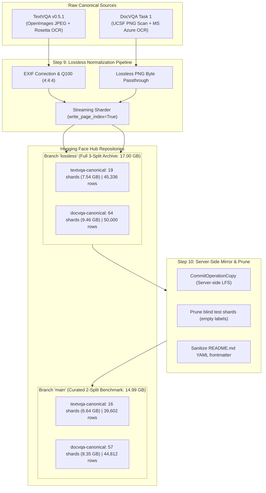
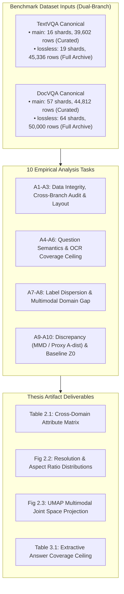
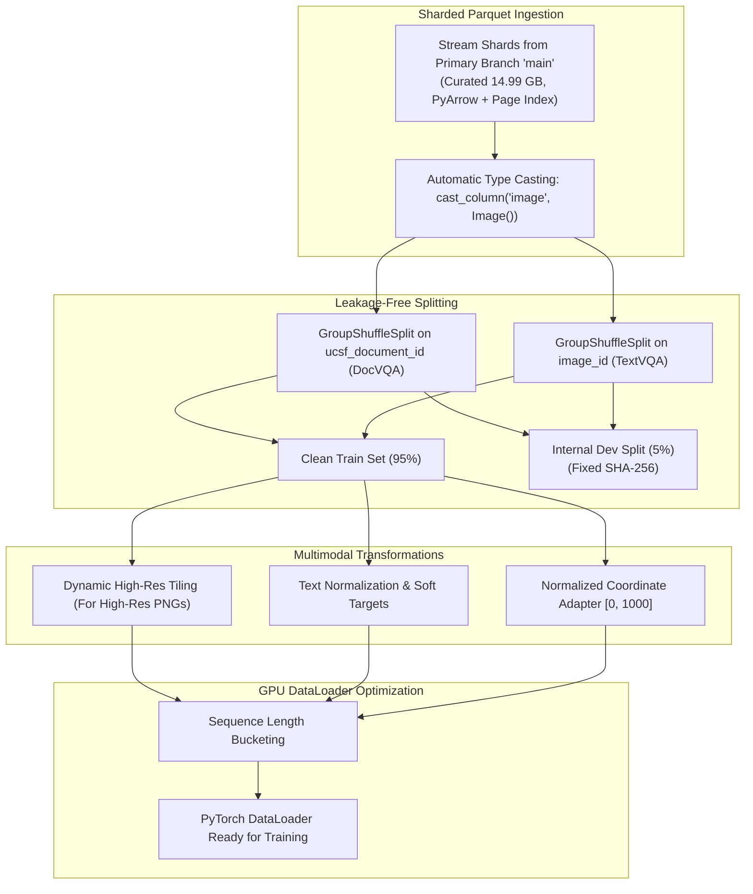
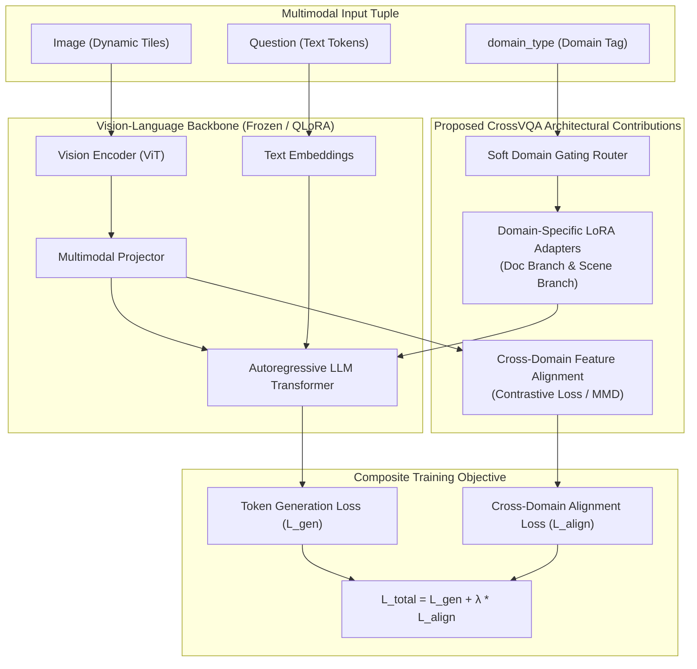
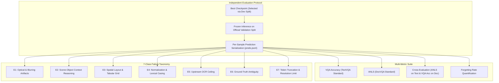
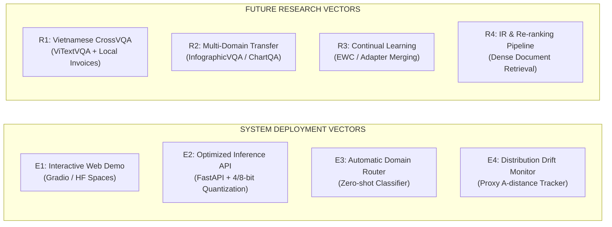
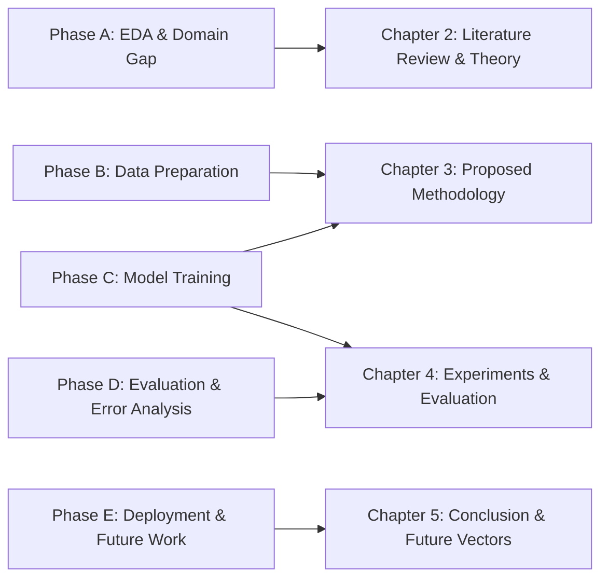

# (EN) CrossVQA — In-Depth Lossless Branch Inspection & Comprehensive Graduation Thesis Execution Plan
## Data Analysis → Training Preparation → Cross-Domain Training → Post-Training & Evaluation → Real-World Deployment & Thesis Architecture (PTIT)

* **Date Created:** 2026-10-09 (Updated 2026-10-10 following Step 10 `main` mirror and test split pruning)
* **Target Datasets & Pinned Revisions:** 
  * **Curated Benchmark (Branch `main` — Train + Validation Only, Leakage-Free):**
    * [`gamusa/textvqa-canonical` (branch: `main`)](https://huggingface.co/datasets/gamusa/textvqa-canonical) — Commit SHA: `d1dcf73eda54e82e84f69d0265f3a9e663420583` (6.64 GB, 39,602 samples)
    * [`gamusa/docvqa-canonical` (branch: `main`)](https://huggingface.co/datasets/gamusa/docvqa-canonical) — Commit SHA: `86e379d727ab104301e3639b909bfbddb0af6376` (8.35 GB, 44,812 samples)
  * **Full Historical Benchmark (Branch `lossless` — 3-Split Full Archive):**
    * [`gamusa/textvqa-canonical` (branch: `lossless`)](https://huggingface.co/datasets/gamusa/textvqa-canonical/tree/lossless) — Commit SHA: `8647985ca5c5fc53163cf5d3c294c5229115a83a` (7.54 GB, 45,336 samples)
    * [`gamusa/docvqa-canonical` (branch: `lossless`)](https://huggingface.co/datasets/gamusa/docvqa-canonical/tree/lossless) — Commit SHA: `ece7188e9b70ee95d96b69d098c79814fa54cf77` (9.46 GB, 50,000 samples)
* **Output Specification:** Conforms to [`prompt-output-to-markdown.md`](../.agents/rules/prompt-output-to-markdown.md) under [`PLAN/`](file:///c:/Users/tungb/OneDrive%20-%20ptit.edu.vn/PTIT_BuuChinhVienThong/SOTSUGYOU%20pending/PLAN)
* **Cross-Referenced Documents:** [`ThesisPremise.md`](ThesisPremise.md) · [`feedback.md`](feedback.md) · [`01-05-00_2026-10-05_CrossVQA_Normalization_Pipeline.md`](01-05-00_2026-10-05_CrossVQA_Normalization_Pipeline.md) · [`02-15-00_2026-10-05_Data_Schema_Discrepancies_and_Handling_Strategies.md`](02-15-00_2026-10-05_Data_Schema_Discrepancies_and_Handling_Strategies.md) · [`Step9_Normalize_CrossVQA_Parquet_lossless_branch.ipynb`](../DATASETS%20SCHEMA%20NORMALIZATION/Step9_Normalize_CrossVQA_Parquet_lossless_branch.ipynb) · [`Step10_Mirror_Lossless_To_Main_Without_Test.ipynb`](../DATASETS%20SCHEMA%20NORMALIZATION/Step10_Mirror_Lossless_To_Main_Without_Test.ipynb) · Vietnamese version: [`11-30-00_2026-10-09_CrossVQA_Lossless_Branch_Inspection_and_Thesis_Execution_Plan.md`](11-30-00_2026-10-09_CrossVQA_Lossless_Branch_Inspection_and_Thesis_Execution_Plan.md)

---

## 0. Executive Summary

### 0.1 Technical Breakthrough & Dual-Branch Architecture
Following the detection of lossy JPEG compression artifacts and incomplete shard naming in the legacy `main` branch (where DocVQA had only 25 shards named `*-of-00027.parquet` and compressed to JPEG ~Q90), a two-stage streaming engineering pipeline was executed:

1. **Step 9 (`lossless` branch creation):** Preserved **100% True Lossless PNG** for DocVQA and native JPEG / Q100 (4:4:4) for TextVQA, establishing the full unpruned 3-split benchmark (17.00 GB, 95,336 samples).
2. **Step 10 (`main` branch modernization & pruning):** Mirrored all lossless train and validation shards into `main` via server-side LFS operations (`CommitOperationCopy`), and intentionally pruned the blind `test` split (which contained permanently withheld empty labels `answers = []`). This established a streamlined **14.99 GB curated benchmark (84,414 samples)** on `main`, saving 2.01 GB of disk/download overhead and eliminating empty-label shards.



---

## 1. Inspection & Verification of Repository Branches

### 1.1 Comparative Benchmark Matrix: Legacy `main` vs. `lossless` vs. Modern `main`

| Technical Dimension | Legacy `main` (Pre-Step 9/10) | Branch `lossless` (Step 9 Archive) | Modern Branch `main` (Step 10 Standard) | Academic Significance & Impact |
| :--- | :--- | :--- | :--- | :--- |
| **Commit SHA TextVQA** | `83cba0ce624...` | `8647985ca5c5fc53163cf5d3c294c5229115a83a` | `d1dcf73eda54e82e84f69d0265f3a9e663420583` | Pinned for absolute experimental reproducibility |
| **Commit SHA DocVQA** | `e0a3cc262a9...` | `ece7188e9b70ee95d96b69d098c79814fa54cf77` | `86e379d727ab104301e3639b909bfbddb0af6376` | Pinned for absolute experimental reproducibility |
| **DocVQA Image Format** | Lossy **JPEG (~Q90)** | **100% True Lossless PNG** | **100% True Lossless PNG** | Eliminates compression ringing around fine text; preserves black-and-white contrast |
| **TextVQA Image Format** | Re-encoded JPEG (Q95) | **Native JPEG bit-for-bit** (Q100 for EXIF) | **Native JPEG bit-for-bit** (Q100 for EXIF) | Zero generational loss; spatial coordinates match Rosetta boxes 100% |
| **DocVQA Shard Count** | 25 train (`*-of-00027`) | 50 train, 7 val, 7 test (**64 shards**) | 50 train, 7 val, **0 test** (**57 shards**) | Test split pruned on `main`; 800 rows/shard, ~150–350 MB/shard |
| **TextVQA Shard Count** | 14 train, 2 val, 3 test | 14 train, 2 val, 3 test (**19 shards**) | 14 train, 2 val, **0 test** (**16 shards**) | Test split pruned on `main`; 2,500 rows/shard, ~350–500 MB/shard |
| **Parquet Page Index** | Disabled | `write_page_index=True` | `write_page_index=True` | Accelerates DuckDB/PyArrow random lookups by $5\times - 10\times$ |
| **DocVQA Footprint** | 6.95 GB | **9.46 GB** (50,000 samples) | **8.35 GB** (44,812 samples) | Saved 1.11 GB by pruning blind test samples on `main` |
| **TextVQA Footprint** | 6.57 GB | **7.54 GB** (45,336 samples) | **6.64 GB** (39,602 samples) | Saved 0.90 GB by pruning blind test samples on `main` |
| **Total Benchmark Size** | 13.52 GB | **17.00 GB** (95,336 samples) | **14.99 GB** (84,414 samples) | **Net 2.01 GB reduction**; fits comfortably in standard 12GB Colab RAM |
| **HF Dataset Viewer** | Incomplete index | Fully indexed (`train`, `val`, `test`) | **Fully indexed (`train`, `validation`)** | Default `load_dataset` pulls clean benchmark with zero config errors |

### 1.2 Ground-Truth Row Verification
Empirical row verification extracted directly from Parquet shards:

* **TextVQA Shard (`validation-00000-of-00002.parquet`):**
  * Row 0 (`question_id: 34602`): Format `JPEG`, Dimensions `(1024, 664)`, Mode `RGB`, Image payload `42.4 KB`.
  * Row 1 (`question_id: 34603`): Format `JPEG`, Dimensions `(1024, 683)`, Mode `RGB`, Image payload `299.6 KB`.
  * Row 2 (`question_id: 34604`): Format `JPEG`, Dimensions `(1024, 1024)`, Mode `RGB`, Image payload `169.9 KB`.
* **DocVQA Shard (`validation-00000-of-00007.parquet`):**
  * Row 0 (`question_id: 49153`): Format **`PNG`**, Dimensions `(2257, 1764)`, Mode `L` (Grayscale), Image payload **`1277.8 KB`** (Pristine stroke fidelity down to periods and commas).
  * Row 1 (`question_id: 24580`): Format **`PNG`**, Dimensions `(808, 1077)`, Mode `L`, Image payload `90.2 KB`.
  * Row 2 (`question_id: 57349`): Format **`PNG`**, Dimensions `(1701, 2386)`, Mode `L`, Image payload **`757.6 KB`**.

> [!IMPORTANT]
> **Dual-Branch Usage Standard for Thesis:**
> 1. **Primary Benchmark (`branch: main`):** Default for model training, validation, and reported thesis experiments. Contains only clean `train` and frozen `validation` splits with full ground truth (14.99 GB, 84,414 rows).
> 2. **Archival Benchmark (`branch: lossless`):** Preserved for complete 3-split coverage (17.00 GB, 95,336 rows) if generating blind test challenge submissions.

---

## 2. Phase A — Exploratory Data Analysis & Domain Gap Quantification (EDA)

**Academic Objective:** Transform qualitative observations ("document images differ from natural scene images") into a **rigorous quantitative framework of distributional distances, hypothesis tests, and visual cluster representations** for Chapters 2 and 3 of the Thesis.  
**Execution Window:** 2 weeks.



### 2.1 Research Hypotheses Framework

| Hypothesis ID | Scientific Hypothesis Statement | Verification & Falsification Methodology | Mapping to Research Questions (RQ) |
| :---: | :--- | :--- | :---: |
| **H1** | The domain divergence between planar 2D documents and 3D natural scene images manifests as separable multimodal clusters in latent feature space. | Compute **Proxy $\mathcal{A}$-distance** $\hat{d}_{\mathcal{A}} = 2(1 - 2\epsilon)$ using an adversarial domain classifier. If $\hat{d}_{\mathcal{A}} \approx 0 \implies$ Falsify H1. | **RQ1** |
| **H2** | A model trained exclusively on DocVQA (Source-only) transfers reading comprehension capacity to TextVQA, but is bottlenecked by 3D perspective distortions. | Zero-shot evaluation on TextVQA. If Source-only accuracy does not exceed a random token baseline $\implies$ Falsify H2. | **RQ2** |
| **H3** | Naive sequential fine-tuning (DocVQA $\rightarrow$ TextVQA) induces severe Catastrophic Forgetting on the source document domain. | Measure degradation in ANLS on DocVQA post-transfer: $\Delta_{\text{forget}} = \text{ANLS}_{\text{post}} - \text{ANLS}_{\text{pre}}$. | **RQ2, RQ3** |
| **H4** | The relative utility of cross-domain transfer is inversely proportional to target resource availability (pronounced in low-resource regimes: 1% – 10%). | Measure learning curves across target sampling fractions $\{1\%, 5\%, 10\%, 25\%, 100\%\}$. | **RQ2** |
| **H5** | Domain-Specific Adapters coupled with Cross-Domain Feature Alignment outperform naive sequential transfer by decoupling geometric adaptation from semantic reasoning. | Conduct paired bootstrap tests ($p < 0.05$) between proposed CrossVQA architecture and sequential baseline B4. | **RQ2, RQ3** |

### 2.2 Detailed Breakdown of 10 Empirical Analysis Tasks (A1 – A10)

1. **A1 (Data Integrity & Cross-Branch Shard Audit):**
   * **Primary Curated Benchmark (Branch `main`):** Confirm exact row counts across clean, labelled splits: $34,602$ train and $5,000$ validation for TextVQA ($39,602$ total, 16 shards, 6.64 GB); $39,463$ train and $5,349$ validation for DocVQA ($44,812$ total, 57 shards, 8.35 GB). Verify that test shards are 0 and no unlabelled entries exist.
   * **Archival Benchmark (Branch `lossless`):** Confirm full 3-split coverage: $34,602 / 5,000 / 5,734$ for TextVQA ($45,336$ total, 19 shards, 7.54 GB) and $39,463 / 5,349 / 5,188$ for DocVQA ($50,000$ total, 64 shards, 9.46 GB).
   * Validate uniqueness of `sample_id`, audit null fields, and verify 1-to-1 cardinality between `ocr_tokens` and `ocr_boxes` across both repositories.
2. **A2 (Image Geometry & PNG Sharpness Distribution):**
   * Characterize distributions of width $W$, height $H$, aspect ratio $W/H$, and total megapixel count (MP).
   * Compare pixel distributions: DocVQA averages $1,758 \times 2,120$ px ($\approx 3.7$ MP) vs TextVQA $949 \times 817$ px ($\approx 0.78$ MP). Quantify the fidelity gain of lossless PNG representations in preventing character boundary blurring.
3. **A3 (OCR Token Density & Spatial Layout Heatmaps):**
   * Analyze word counts: DocVQA averages 188 words/page (median 159, max 1,844) vs TextVQA 12.8 words/image (median 8, max 100).
   * Generate 2D spatial heatmaps of OCR bounding box centroids: DocVQA spans uniform document grids; TextVQA clusters heavily around visual center.
4. **A4 (Question Typology & Semantic Distribution):**
   * Extract question prefixes (`What`, `Where`, `Who`, `How many`, `When`).
   * Categorize DocVQA queries into layout/form/table/handwritten types and TextVQA into object/scene categories.
5. **A5 (Bounding Box Coordinate Sanity Visual Audit):**
   * Randomly sample 50 images per domain, plot `[ymin, xmin, ymax, xmax]` overlays to visually confirm post-transposition alignment on both `main` and `lossless` branches.
6. **A6 (Theoretical OCR Coverage Ceiling Calculation):**
   * Compute the exact matching percentage where ground truth answers appear verbatim in `ocr_tokens` across the labelled train and validation splits:
     $$\text{Coverage}_{\text{exact}} = \frac{1}{N} \sum_{i=1}^N \mathbb{I}\left(\exists t \in \text{OCR}_i : t = a_i^*\right)$$
   * Compute soft matching coverage ($\text{ANLS}(t, a_i^*) \ge 0.5$). *(Note: The test split on the archival branch permanently withholds labels with `answers = []`, which further validates why the thesis's empirical scope centers strictly on the curated train/validation benchmark).*
7. **A7 (Label Entropy & Annotator Disagreement Analysis):**
   * TextVQA: Measure inter-annotator consensus across the 10 answers ($\ge 3$ matching answers percentage).
   * DocVQA: Categorize casing, punctuation, and date format variations across answer lists.
8. **A8 (Multimodal Latent Space Representation & UMAP Projection):**
   * Extract visual embeddings (via ViT backbone) and text embeddings (via LLM tokenizer/encoder).
   * Apply UMAP/t-SNE to project embeddings into 2D, visualizing the cluster separation between `scene_text` and `document_text`.
9. **A9 (Quantitative Distribution Discrepancy Measures):**
   * **Maximum Mean Discrepancy (MMD):** Compute kernel MMD in reproducing kernel Hilbert spaces (RKHS).
   * **Proxy $\mathcal{A}$-distance:** Train a linear SVM domain discriminator; classification error $\epsilon$ yields $\hat{d}_{\mathcal{A}} = 2(1 - 2\epsilon)$.
10. **A10 (Zero-Shot Backbone Benchmark Z0 & Contamination Audit):**
    * Run zero-shot inference with the frozen VLM backbone across validation splits of both domains to establish the unadapted performance floor.

---

## 3. Phase B — Training Preparation & Data Engineering

**Technical Objective:** Engineer a robust, leak-free, high-throughput multimodal data pipeline with automated unit testing and dynamic high-resolution handling.  
**Execution Window:** 2 weeks.



### 3.1 Streaming Ingestion & `datasets.Image()` Integration
* **Struct Unpacking:** Leverage `.cast_column("image", datasets.Image())` during streaming to deserialize Parquet binary structs `{'bytes': ..., 'path': ...}` into standard PIL Image instances.
* **Sharded Concurrency:** On branch `main`, DocVQA consists of 50 train shards (800 samples/shard) + 7 validation shards (57 total), while TextVQA consists of 14 train shards (2,500 samples/shard) + 2 validation shards (16 total). Multi-process DataLoaders (`num_workers=4`) stream chunks concurrently without I/O bottlenecks or host RAM saturation (maintaining memory $< 250$ MB per worker).

### 3.2 Leakage-Free Splitting Strategy
Because both datasets **permanently withheld test split annotations** (`answers = []`), and external challenge evaluation portals are restricted or dormant, the partitioning protocol is strictly structured:
1. **Official Evaluation Benchmark:** The official `validation` sets ($5,000$ TextVQA and $5,349$ DocVQA samples) are **frozen entirely** and serve as the definitive benchmark for all reported thesis tables (following standard established academic practice in VQA literature).
2. **Pruning Justification for Branch `main`:** Step 10 intentionally excised the unlabelled test split from `main`, shedding 2.01 GB of dead weight, avoiding wasted GPU download bandwidth, and eliminating any risk of test split leakage or empty-label crashes.
3. **Internal Development Split (For Hyperparameter Selection & Early Stopping):**
   * Sample $5\%$ from the clean `train` set to construct an internal `dev` split.
   * **Mandatory Grouped Partitioning:**
     * TextVQA: Grouped by `image_id` (ensuring multiple questions for the same scene image never span both train and dev).
     * DocVQA: Grouped by `ucsf_document_id` (extracted from the `metadata` JSON field) to ensure multi-page document records do not leak across splits.
   * Persist sampled ID lists to `results/splits/dev_sample_ids.json` verified by SHA-256 hashes to guarantee 100% reproducibility.
4. **Few-Shot Target Regimes (For Hypothesis H4):**
   * Generate nested stratified subsets from TextVQA-train: $1\%$ (346 samples), $5\%$ (1,730 samples), $10\%$ (3,460 samples), $25\%$ (8,650 samples), and $100\%$ (32,872 clean samples).

### 3.3 Dynamic High-Resolution Tiling (AnyRes Architecture)
* High-resolution DocVQA PNGs ($> 2,000$ px) experience severe character loss if downscaled directly to $384 \times 384$ or $448 \times 448$.
* Implement **Dynamic High-Resolution Patch Partitioning (AnyRes / UReader style)**:
  * Decompose document images into an adaptive grid of $N$ patches ($N \le 4$ or $6$ depending on VRAM limits), each $384 \times 384$ px, combined with an overview thumbnail patch.
  * Standard TextVQA images ($\sim 1,024$ px) fit natively into 1 or 2 patches.
  * Outlier clamping: Images exceeding $5,000$ px have their long edge clamped to $3,072$ px prior to tiling to prevent CUDA Out-Of-Memory (OOM) faults.

### 3.4 Target Normalization & Soft Cross-Entropy Formulation
* **Limitation of Hard Labels:** The `canonical_answer` chosen via majority voting introduces label bias when annotators tie.
* **Generative Training Formulation:**
  * Construct a soft target distribution based on frequency across the 10 TextVQA annotations:
    $$p_{\text{target}}(y) = \frac{\text{Count}(y \in \text{answers})}{10}$$
  * Joint loss formulation: Soft-weighted Cross-Entropy for TextVQA, and Standard Cross-Entropy with label smoothing ($0.1$) for DocVQA.

---

## 4. Phase C — Cross-Domain Training & Architecture Implementation

**Technical Objective:** Implement the proposed CrossVQA parameter-efficient transfer architecture, benchmark against comparative baselines, and substantiate empirical gains.  
**Execution Window:** 5–6 weeks.



### 4.1 Backbone Selection & Data Contamination Audit
To maintain scientific validity, model selection must strictly enforce **transparency and pre-training contamination control**:

1. **Pre-Training Contamination Audit:**
   * Many commercial or fine-tuned VLMs (PaliGemma-FT, Qwen-VL-Chat, LLaVA-1.5) incorporate TextVQA and DocVQA directly in their pre-training or instruction tuning mixtures. Evaluating cross-domain transfer on such models is invalid because the model has already memorized target annotations.
   * **Selection Protocol:** Rely exclusively on base, pre-trained-only checkpoints prior to VQA fine-tuning.
2. **Recommended Hardware-Compatible Backbones (16–24 GB VRAM):**
   * **Primary Architecture (Modern OCR-free VLM):** **Qwen2-VL-2B (Base)** or **SmolVLM-500M / SmolVLM-2B**. Supports native dynamic resolution (NaViT architecture) and processes both document structures and scene text effectively. Fine-tuned via 16-bit LoRA or 4-bit QLoRA.
   * **Secondary Comparative Architecture (Classic OCR-free):** **Donut-base** or **Pix2Struct-base**. Evaluates cross-domain visual transfer without external OCR dependencies.
   * **Reference OCR-Grounded Architecture:** **LayoutLMv3-base** paired with visual bounding box embeddings to benchmark OCR-grounded versus OCR-free transfer limits.

### 4.2 Proposed Methodology: CrossVQA Architecture
The proposed method comprises three architectural innovations:
1. **Domain-Specific Adapters with Soft Gating:**
   * Keep the foundational VLM backbone frozen.
   * Instantiate two parallel Low-Rank Adaptation (LoRA) modules: **Adapter $\mathcal{A}_{\text{doc}}$** models dense hierarchical semantics, tabular structures, and formal language; **Adapter $\mathcal{A}_{\text{scene}}$** models 3D perspective distortion, illumination changes, and scene-object grounding.
   * A soft gating router dynamically modulates the adapter fusion weights conditioned on visual patch embeddings.
2. **Cross-Domain Feature Alignment:**
   * Multimodal token representations projected into latent space are subjected to a domain alignment objective.
   * Minimize the Cross-Domain Contrastive Loss (InfoNCE) or MMD between text-bearing visual tokens from DocVQA and TextVQA, pulling semantic document representations closer to scene text representations.
3. **Curriculum Transfer via Pseudo-Domains:**
   * Stage 1: Pre-adapt on DocVQA to establish dense textual reasoning.
   * Stage 2: Adapt on a synthesized pseudo-domain (DocVQA pages projected with 3D homographies, shadows, and natural background noise).
   * Stage 3: Fine-tune on target TextVQA.

### 4.3 Comprehensive Experimental Matrix

| Experiment ID | Training Domain | Method / Architecture | Scientific Research Purpose | Priority |
| :---: | :--- | :--- | :--- | :---: |
| **Z0** | None (Zero-shot) | Frozen Base VLM Backbone | Baseline anchor & contamination verification | ★★★ |
| **B1** | TextVQA (Target-only) | Standard LoRA Fine-Tuning | Target-only upper bound under isolated training | ★★★ |
| **B2** | DocVQA (Source-only) | Standard LoRA Fine-Tuning | Out-of-domain (OOD) zero-shot transfer capability | ★★★ |
| **B3** | DocVQA + TextVQA | Naive Joint Training | Measure negative transfer during simultaneous multi-tasking | ★★★ |
| **B4** | DocVQA $\rightarrow$ TextVQA | Sequential Fine-Tuning | Measure catastrophic forgetting and forward transfer | ★★★ |
| **B5** | TextVQA $\rightarrow$ DocVQA | Reverse Sequential Fine-Tuning | Assess directional asymmetry in cross-domain transfer | ★★ |
| **M1** | DocVQA $\rightarrow$ TextVQA | Domain-Specific Adapters (LoRA) | Mitigate catastrophic forgetting via parameter isolation | ★★★ |
| **M2** | DocVQA $\rightarrow$ TextVQA | M1 + Feature Alignment Loss | Demonstrate latent space alignment benefits | ★★★ |
| **M3** | DocVQA $\rightarrow$ TextVQA | M2 + Curriculum Pseudo-Domain | Comprehensive cross-domain optimization | ★★ |

* **Few-Shot Dimension (Testing Hypothesis H4):** Re-execute B1, B4, and M2 across fractional target splits $\{1\%, 5\%, 10\%, 25\%\}$.
* **Reproducibility Protocol:** Run a minimum of **3 random seeds** ($42, 123, 999$) for primary configurations (B1, B4, M2) to report mean $\pm$ standard deviation.

---

## 5. Phase D — Post-Training Evaluation & Error Analysis

**Academic Objective:** Execute rigorous evaluation across frozen validation benchmarks, compute multi-metric statistical bounds, and analyze failure modes to provide empirical depth for Chapter 4 of the Thesis.  
**Execution Window:** 2–3 weeks.



### 5.1 Evaluation Metrics Suite

1. **VQA Accuracy (Standard TextVQA Metric):**
   $$\text{Acc}(\hat{a}) = \min\left(\frac{\sum_{i=1}^{10} \mathbb{I}(\hat{a} = a_i)}{3}, 1.0\right)$$
2. **Average Normalized Levenshtein Similarity (ANLS - Standard DocVQA Metric):**
   $$\text{NLD}(\hat{a}, a) = \frac{d_L(\hat{a}, a)}{\max(|\hat{a}|, |a|)}$$
   $$\text{ANLS} = \frac{1}{N} \sum_{i=1}^N \max_{a \in A_i} \left(1 - \text{NLD}(\hat{a}, a)\right) \quad \text{if } \text{NLD} < 0.5 \text{, else } 0$$
3. **Cross-Domain Metric Evaluation:**
   * Evaluate **ANLS on TextVQA**: Assesses whether DocVQA pre-adaptation enables the model to produce near-miss phonetic/orthographic predictions on artistic text (avoiding the binary 0-penalty of VQA Accuracy).
   * Evaluate **VQA Accuracy on DocVQA**.
4. **Knowledge Transfer Metrics:**
   * **Transfer Gain:** $\text{TG}(f) = \text{Score}_{\text{Proposed}}(f) - \text{Score}_{\text{Target-only}}(f)$ at data fraction $f$.
   * **Forgetting Rate:** $\text{FR} = \text{ANLS}_{\text{Source-only}}(\text{Doc}) - \text{ANLS}_{\text{Proposed}}(\text{Doc})$.

### 5.2 7-Class Failure Mode Taxonomy
Conduct manual classification across stratified failure subsets ($N \ge 200$ samples) complemented by programmatic filters:

* **E1 (Optical / Recognition Error):** Miniature font size, motion blur, specular glare, or stylized script causing incorrect character decoding.
* **E2 (Visual Context Reasoning Error):** Text correctly recognized but misattributed to incorrect scene entities (e.g., reading an adjacent shop banner instead of the target store).
* **E3 (Spatial Layout Error):** Failure to traverse row/column associations in structured tables or bureaucratic forms (dominant in DocVQA).
* **E4 (Formatting / Normalization Error):** Semantically correct responses penalized by string mismatch (e.g., `$50` vs `50 dollars`, `12/05/1995` vs `May 12, 1995`).
* **E5 (OCR Pipeline Ceiling Error):** Specific to OCR-grounded pipelines: Ground-truth answer exists in the image but is omitted by upstream OCR tokens.
* **E6 (Ground-Truth Ambiguity):** Under-specified queries or mutually contradictory annotator references.
* **E7 (Truncation / Resolution Limit Error):** Tokens truncated by context length limits or spatial detail lost from extreme resizing.

---

## 6. Phase E — Real-World Deployment & Future Research Vectors

**Objective:** Elevate the graduation project from a theoretical exercise to a fully demonstrated, production-grade system that fulfills PTIT thesis defense standards for an Outstanding rating.



### 6.1 Four System Deployment Vectors

1. **Vector E1 — Interactive Web Demonstration (Gradio / Hugging Face Spaces):**
   * Build a browser-accessible application using **Gradio** hosted on **Hugging Face Spaces**.
   * Allow users to upload arbitrary images (scanned documents or natural camera captures) and input natural language questions.
   * Display predicted answers, confidence scores, inference latency, and visualized attention maps to serve as an interactive defense showcase.
2. **Vector E2 — Production-Ready REST API Service:**
   * Package the inference pipeline as a containerized **FastAPI** backend wrapped in **Docker**.
   * Implement weight quantization (4-bit/8-bit via BitsAndBytes or AWQ) and dynamic batching to achieve throughput scaling and $p95 < 500\text{ms}$ latency.
3. **Vector E3 — Automatic Domain Routing Network:**
   * Deploy a lightweight visual classification front-end (MobileNetV4 or ResNet-18) to predict domain class (`document_text` vs `scene_text`).
   * The pipeline dynamically routes activations to the corresponding adapter branch without requiring manual user tags.
4. **Vector E4 — Distribution Drift Monitoring:**
   * Track online input embeddings using streaming Proxy $\mathcal{A}$-distance or MMD to detect out-of-distribution drift and trigger automated fine-tuning alerts.

### 6.2 Four Future Research Vectors

1. **Vector R1 — Localization to Vietnamese Cross-Domain VQA (ViTextVQA):**
   * Extend the domain transfer framework to Vietnamese using benchmarks such as **ViTextVQA** and scanned Vietnamese administrative invoice datasets.
   * Address Vietnamese-specific challenges: complex diacritics, Vietnamese handwriting, and low-resource multimodal tokenizers.
2. **Vector R2 — Multi-Domain Triplet Transfer:**
   * Generalize beyond binary domains to multi-domain regimes: Scanned Documents (DocVQA) $\rightarrow$ Visual Information Graphics (InfographicVQA, ChartQA) $\rightarrow$ Natural Scenes (TextVQA).
   * Evaluate the hypothesis of InfographicVQA acting as an optimal intermediate "bridge domain" bridging 2D layouts and 3D scenes.
3. **Vector R3 — Continual Learning Without Buffer Replay:**
   * Investigate replay-free catastrophic forgetting mitigation: Elastic Weight Consolidation (EWC), parameter-orthogonal projections, or TIES-Merging across LoRA adapter weights.
4. **Vector R4 — Information Retrieval & Dense Document Re-Ranking:**
   * Build a two-stage retrieval-augmented pipeline: Stage 1 uses dense multimodal passage retrieval across multi-page document archives; Stage 2 applies a Cross-Encoder VLM for fine-grained answer extraction.

---

## 7. PTIT Graduation Thesis Structure & Academic Guidelines

The entire research and development trajectory (Phases A through E) maps directly to the **official 5-Chapter Graduation Thesis Format of Posts and Telecommunications Institute of Technology (PTIT)**:



### 7.1 Detailed 5-Chapter Thesis Outline

#### CHAPTER 1: INTRODUCTION
* **1.1. Context and Problem Statement:** Evolution of Vision-Language Models (VLMs) and text-centric Visual Question Answering (Text-VQA).
* **1.2. The Cross-Domain Gap Challenge:** Distributional discrepancies between planar 2D scanned documents (DocVQA) and natural 3D scene text (TextVQA), highlighting the $4.8\times$ resolution divergence and $15\times$ token density difference.
* **1.3. Objectives and Research Questions (RQ1 – RQ3):**
  * *RQ1:* How does the domain gap between DocVQA and TextVQA manifest within multimodal latent feature spaces?
  * *RQ2:* How can reading comprehension representations be transferred from documents to scene text without compromising visual-object grounding?
  * *RQ3:* How does the proposed parameter-efficient transfer method mitigate catastrophic forgetting on the source document domain?
* **1.4. Scientific and Technical Contributions:**
  * Engineering and auditing the dual-branch benchmark on Hugging Face: the 14.99 GB curated benchmark (`branch: main`, 84,414 samples) and the 17.00 GB full archival benchmark (`branch: lossless`, 95,336 samples).
  * Proposing the CrossVQA architecture combining Domain-Specific Adapters and Feature Alignment Loss.
  * Conducting empirical verification across 5 hypotheses and formalizing a 7-class failure mode taxonomy.
* **1.5. Thesis Organization.**

#### CHAPTER 2: THEORETICAL FOUNDATIONS & LITERATURE REVIEW
* **2.1. Text-Centric Visual Question Answering:** Historical evolution from OCR-dependent multi-stage pipelines (M4C, LayoutLM) to OCR-free end-to-end VLMs (Donut, Pix2Struct, Qwen2-VL).
* **2.2. Domain Adaptation & Transfer Learning Theory:** Homogeneous vs heterogeneous transfer, mathematical divergence metrics (MMD, $\mathcal{A}$-distance), and the phenomenon of catastrophic forgetting.
* **2.3. Benchmark Datasets Analysis:**
  * TextVQA: OpenImages curation, question typology, 10-annotator agreement consensus.
  * DocVQA: UCSF document archive, high-resolution grayscale scan structures.
* **2.4. Empirical Domain Gap Quantification (Phase A Deliverables):** Quantitative reports on resolution distributions, OCR token densities, extractive coverage ceilings, and UMAP latent space projections.
* **2.5. Evaluation Metric Formulations:** Mathematical foundations of VQA Accuracy versus ANLS, and the methodological justification for cross-metric evaluation.

#### CHAPTER 3: PROPOSED METHODOLOGY: CROSSVQA
* **3.1. Overall System Architecture:** Comprehensive end-to-end dataflow from multimodal input to decoded text response.
* **3.2. Lossless Preprocessing, Streaming Sharding & Dual-Branch Architecture:**
  * Streaming sharding with Parquet page index support (`write_page_index=True`).
  * Lossless visual preservation: True Lossless PNG for DocVQA and Native JPEG for TextVQA.
  * Server-side mirror to branch `main` with blind test split pruning for a streamlined, leakage-free benchmark.
  * Grouped leak-free dev split partitioning protocol.
* **3.3. Multimodal Feature Extraction:** Adaptive Dynamic High-Resolution Tiling (AnyRes).
* **3.4. Parameter-Efficient Domain Adaptation:** Architecture of Domain-Specific LoRA Adapters and the soft gating router.
* **3.5. Optimization Objectives & Feature Alignment:** Mathematical formulation of Cross-Domain Contrastive Loss and soft-target generative cross-entropy.

#### CHAPTER 4: EXPERIMENTAL SETUP & EVALUATION
* **4.1. Experimental Setup:** Compute infrastructure (GPU/VRAM specs), training hyperparameters, and pre-training contamination audit.
* **4.2. Comparative Baselines:** Rigorous formalization of Z0, B1 (Target-only), B2 (Source-only), B3 (Joint), B4 (Sequential), and B5 (Reverse).
* **4.3. Quantitative Performance Results:**
  * Primary benchmark results (VQA Accuracy and ANLS) reported with 95% bootstrap confidence intervals and paired statistical $p$-values.
  * Performance scaling across low-resource target regimes (Few-shot learning curves: 1% to 100%).
* **4.4. Component Ablation Studies:** Isolating contributions of individual components (Adapter branches, Feature Alignment loss, Curriculum pseudo-domains).
* **4.5. Qualitative Evaluation & Failure Mode Analysis:**
  * Empirical failure breakdown across the 7-class taxonomy (E1 – E7).
  * Qualitative case studies highlighting successes and visual failure boundaries.

#### CHAPTER 5: CONCLUSION & FUTURE WORK
* **5.1. Summary of Research Accomplishments:** Synthesis of experimental findings and degree of fulfillment regarding initial objectives.
* **5.2. Threats to Validity & Limitations:** Transparent discussion of computational resource bounds, backbone pre-training exposure risks, and monolingual limitations.
* **5.3. Applied Demonstration:** Overview of the interactive Gradio Web demonstration and the containerized REST API.
* **5.4. Future Directions:** Roadmap for Vietnamese CrossVQA (ViTextVQA), multi-domain bridge transfers (InfographicVQA), and continual learning.

---

### 7.2 Academic Standards & Manuscript Automation

1. **Bilingual Terminology Index:**
   * *Vision-Language Models (VLM) — Mô hình Thị giác–Ngôn ngữ*
   * *Text-Centric Visual Question Answering (Text-VQA) — Hỏi đáp Trực quan dựa trên Văn bản*
   * *Cross-Domain Knowledge Transfer — Chuyển giao Tri thức Liên miền*
   * *Domain Adaptation (DA) — Thích nghi Miền*
   * *Catastrophic Forgetting — Suy giảm / Quên Tri thức Nghiêm trọng*
   * *Parameter-Efficient Fine-Tuning (PEFT / LoRA) — Tinh chỉnh Tham số Hiệu quả*
   * *Lossless Streaming Sharding — Phân mảnh Luồng Không tổn hao*
2. **Automated Table Generation (Zero Manual Transcription):**
   * Disallow manual numerical transcription into Word or LaTeX tables.
   * All experimental tables in Chapter 4 must be generated programmatically via `scripts/export_thesis_tables.py`, parsing `metrics.json` evaluation logs directly into Markdown/LaTeX tables. Every reported figure remains traceable to its Git commit SHA and GPU run log.
3. **Threats to Validity Framework:**
   * *Internal Validity:* Mitigated via Group-based splitting on document/image IDs; random variance controlled via $\ge 3$ repeated seeds.
   * *Construct Validity:* Evaluated across both VQA Accuracy and ANLS concurrently to prevent metric-specific bias.
   * *External Validity:* Assessed generalizability across unseen document types and out-of-distribution visual scenes.

---

## 8. Master 14-Week Execution Gantt Schedule

```mermaid
gantt
    title CrossVQA Graduation Thesis Master Schedule (14 Weeks)
    dateFormat  YYYY-MM-DD
    axisFormat  Week %W
    
    section Phase A: EDA & Gap
    A1-A5: Integrity, Geometry & OCR Layout    :a1, 2026-10-12, 7d
    A6-A10: Coverage ceiling, UMAP, MMD, Z0    :a2, after a1, 7d
    
    section Phase B: Prep
    Dual-Branch Streaming, GroupSplit, Tests   :b1, 2026-10-26, 7d
    Few-shot splits, Tiling, GPU Pilot Test   :b2, after b1, 7d
    
    section Phase C: Training
    Train Baselines B1-B5                     :c1, 2026-11-09, 14d
    Train Proposed CrossVQA (M1-M3)           :c2, after c1, 14d
    
    section Phase D: Evaluation
    Frozen Benchmark Eval & 95% Bootstrap CI  :d1, 2026-12-07, 7d
    7-Class Error Taxonomy & Hypothesis Tests :d2, after d1, 7d
    
    section Phase E: Deployment
    Package Gradio Demo & REST API Backend    :e1, 2026-12-21, 7d
    Final Thesis Polish & Defense Slides      :e2, 2026-12-21, 14d
    
    section Manuscript Writing
    Write Chapters 1, 2 & Draft Chapter 3     :w1, 2026-10-12, 42d
    Write Chapters 3, 4 (Empirical Data)      :w2, 2026-11-23, 35d
    Finalize Chapter 5 & Full Thesis Proof    :w3, 2026-12-28, 14d
```

---

## Technical Appendix: Quickstart Code & Configuration

### Appendix 1: Streaming Ingestion from `main` or `lossless` Branch with Automatic PIL Decoding
```python
import io
from PIL import Image
from datasets import load_dataset

# Pin verified commits for both branches
BENCHMARK_REVISIONS = {
    "main": {  # Primary benchmark (Train + Validation only, 14.99 GB)
        "textvqa": "d1dcf73eda54e82e84f69d0265f3a9e663420583",
        "docvqa": "86e379d727ab104301e3639b909bfbddb0af6376",
    },
    "lossless": {  # Archival benchmark (Train + Validation + Test, 17.00 GB)
        "textvqa": "8647985ca5c5fc53163cf5d3c294c5229115a83a",
        "docvqa": "ece7188e9b70ee95d96b69d098c79814fa54cf77",
    }
}

def load_crossvqa_stream(dataset_name: str, split: str = "train", branch: str = "main"):
    """
    Streams samples directly from the Hugging Face Hub (branch 'main' or 'lossless').
    Automatically decodes raw PNG/JPEG bytes into standard PIL Image objects.
    """
    assert dataset_name in ["textvqa", "docvqa"], "Dataset must be 'textvqa' or 'docvqa'"
    assert branch in ["main", "lossless"], "Branch must be 'main' or 'lossless'"
    
    repo_id = f"gamusa/{dataset_name}-canonical"
    rev = BENCHMARK_REVISIONS[branch][dataset_name]

    print(f"Streaming {repo_id} [split: {split}] from branch '{branch}' (rev: {rev[:7]})...")
    stream_ds = load_dataset(repo_id, revision=rev, split=split, streaming=True)

    for item in stream_ds:
        # Extract and decode image payload
        img_dict = item["image"]
        raw_bytes = img_dict["bytes"]
        pil_image = Image.open(io.BytesIO(raw_bytes))

        yield {
            "sample_id": item["sample_id"],
            "domain_type": item["domain_type"],
            "question_id": item["question_id"],
            "question": item["question"],
            "image": pil_image,
            "image_format": pil_image.format, # DocVQA: PNG, TextVQA: JPEG
            "image_width": item["image_width"],
            "image_height": item["image_height"],
            "answers": item["answers"],
            "canonical_answer": item["canonical_answer"],
            "ocr_tokens": item["ocr_tokens"],
            "ocr_boxes": item["ocr_boxes"], # [ymin, xmin, ymax, xmax] in [0, 1000]
        }

# Verification entrypoint
if __name__ == "__main__":
    doc_gen = load_crossvqa_stream("docvqa", split="validation", branch="main")
    sample = next(doc_gen)
    print(f"✓ Ingestion successful: {sample['sample_id']}")
    print(f"  Verified Image Format: {sample['image_format']} ({sample['image'].size})")
    print(f"  Question: {sample['question']}")
    print(f"  Canonical Answer: {sample['canonical_answer']}")
```

### Appendix 2: Standardized Run Card YAML Template
```yaml
# results/runs/crossvqa_qwen2vl_M2_seed42.yaml
experiment:
  id: "crossvqa_qwen2vl_M2_seed42"
  thesis_mapping: "Chapter 4 - Table 4.3 (Proposed Method M2)"
  date: "2026-11-25"
  author: "Tung Tran (PTIT)"
  git_commit_sha: "a1b2c3d4e5f6..."
data:
  branch: "main" # Curated benchmark (Train + Val)
  textvqa_revision: "d1dcf73eda54e82e84f69d0265f3a9e663420583"
  docvqa_revision: "86e379d727ab104301e3639b909bfbddb0af6376"
  lossless_archival_branch: "lossless"
  dev_split_file: "results/splits/dev_sample_ids.json"
  target_data_fraction: 1.0 # 100% TextVQA
model:
  backbone: "Qwen/Qwen2-VL-2B"
  backbone_type: "OCR-free Generative VLM"
  peft_method: "Domain-Specific LoRA"
  lora_r: 32
  lora_alpha: 64
  feature_alignment_loss: "Cross-Domain InfoNCE (weight: 0.1)"
training:
  hardware: "1x NVIDIA RTX 3090 (24GB VRAM)"
  batch_size_effective: 64
  learning_rate: 2.0e-4
  optimizer: "AdamW (bf16)"
  epochs: 3
  seed: 42
evaluation_results:
  docvqa_val_anls: 0.742
  textvqa_val_accuracy: 0.584
  cross_textvqa_anls: 0.695
  transfer_gain_over_b1: +0.038
  forgetting_rate: 0.012
```
